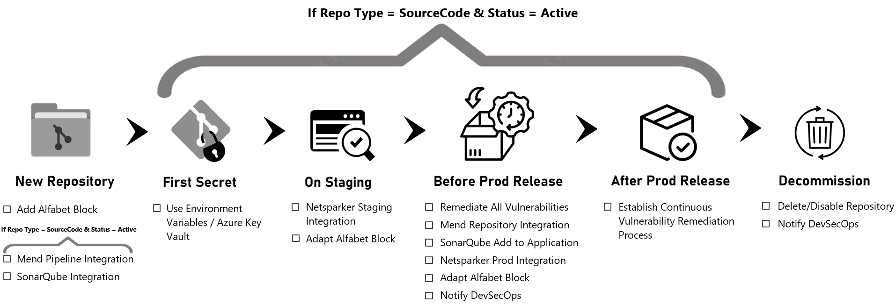

# Introduction to Code Security
According to the [Henkel Corporate Standard Information and Cyber Security (CSIS)](https://henkelgroup.sharepoint.com/:w:/r/teams/InformationSecurity/CSIS/_layouts/15/Doc.aspx?sourcedoc=%7B4E8D5E9B-3451-4566-879D-34889FA2B7E2%7D&file=CS_Information-Cyber-Security.docx&action=default&mobileredirect=true)
application owners/managers and their teams, have to ensure that their applications and code receive adequate technical vulnerability management to identify, manage and remediate vulnerabilities as 
soon as possible but not later as set by the CSIS. 

Application owners/managers and teams of **certain critical projects (RAQN, IPaaS and HDP) are supported by the dxS DevSecOps team and Henkel's DevSecOps security tool stack** in fulfilling 
their obilgation to secure their code. These teams are **required to complete some security tasks for each repository** in order to integrate and work with the security scanners:
 
 - **Inventorize your repositories**
 - **Integrate security scanners (Mend, SonarQube and Netsparker)**
 - **Setup a continuous vulnerability management process to monitor your vulnerabilities**
 - **Remediate your Vulnerabilities soon as possible but not later as set by the CSIS**

### Overview of Security Scanners and Alfabet Block

- [**Alfabet Block:**](https://docs.henkelgroup.cloud/security/security/#why-inventorization-happens) Is a text block, with special prefix/postifx characters, to be added to a readme.md of each repository. It serves the purpose to add machine readable information to each repository like owner, repo type and production url. This information is required in order to properly manage repositories, their ownership and integration to security scanners.
- [**Mend:**](https://docs.henkelgroup.cloud/security/DevSecOps/whitesource/) Is a security scanner (of type SCA Software Composition Analysis) that scans thrid party libraries imported by developers for known vulnerabilities. [**Link to Mend**](https://saas-eu.whitesourcesoftware.com/)
- [**SonarQube:**](https://docs.henkelgroup.cloud/security/DevSecOps/sonarqube/) Is a security scanner (of type SAST Static Application Security Testing) that scans the actual code developers write for vulnerabilities. [**Link to SonarQube**](https://sonarqube.henkelgroup.cloud/) 
- [**Netsparker:**](https://docs.henkelgroup.cloud/security/DevSecOps/netsparker/) Is a security scanner (of type DAST Dynamic Application Security Testing) that scans a webpage or API for vulnerabilities by analyzing the running frontend or API with common attack patterns. Therefore, Netsparker is sending out calls to the webpage or API. [**Link to Netsparker**](https://eu.netsparker.cloud/)

# General Overview of Code Security Tasks along the Repository Lifecycle
The following **overview exemplifies lifecycles a new repository undergoes and the security taks required** to be done in each of them. By following the links below you will be redirected to the dedicated guidelines. All tasks are easy and can be done fast.

### **New Repository**
- [**Add Alfabet Block:** to Readme.md](https://docs.henkelgroup.cloud/security/security/#why-inventorization-happens)
- [**Mend  Pipeline Integration**](whitesource-sub/general.md) **(Only if Repo Type = sourcecode & Status = active):** Integrate with non-production environment to see vulnerability
results for all branches but not fall under vulnerability management of released production applications.

  - "Mend: Repository Integration" LATER! before first production release! as otherwiese CSIS remediation deadlines would apply
- [**SonarQube Integration**](https://docs.henkelgroup.cloud/security/DevSecOps/sonarqube/) **(Only if Repo Type = sourcecode & Status = active):** Integrate with non-production 
environment to see vulnerability results for all branches but not fall under vulnerability management of released production applications.

  - SonarQube: Add Repository to SQ Application LATER! before first production release) 
- *If Repo Type = Documentation | Config | Logic App or (If Repo Type = sourcecode & Status = PoC | Archived) => No DevSecOps tool integrations required*

### **---- From here on assuming: Repo Type = sourcecode & Status = active ----**

### **First Secret** added to Code / Pipeline

- Use Environment Variables / Azure Key Vault

### **On Staging**: after having stagging-URL or swagger API for backend components 

- **Netsparker Staging Integration:** Integrate Staging-URL/Swagger API, therefore reach out to DevSecOps@henkel.com
- [**Adapt Alfabet Block:** Adapt information e.g. STAGING-URL](https://docs.henkelgroup.cloud/security/security/#why-inventorization-happens)

### **Before First Production Release**

- **Remediate All Vulnerabilities (IMPORTANT):** All vulnerabilities in Mend, SonarQube and Netsparker must be remediated before first production release
- [**Mend Repository Integration:**](mend-repository-integration/general.md) Integrate the repository production branch with the production environment to add the production branch
to vulnerability management of released production applications.

- **SonarQube Add to Application:** Add repository to a SonarQube application to add the production branch to vulnerability management of released production applications.
- **Netsparker Prod Integration:** Integrate Prod-URL, therefore reach out to DevSecOps@henkel.com
- [**Adapt Alfabet Block:** Adapt information e.g. Public Exposure, PROD-URL](https://docs.henkelgroup.cloud/security/security/#why-inventorization-happens)
- **Notify DevSecOps:** Inform DevSecOps@Henkel.com about which repo going on production on which date

### **After First Production Release**

- [**Establish Continuous Vulnerability Remediation Process (IMPORTANT):**](https://docs.henkelgroup.cloud/security/DevSecOps/remediation/#recommendations-for-establishing-continous-vulnerability-remediation-process) (Meaning, be informed about new vulnerabilities and plan their remediation according to CSIS Deadlines: Critical fix directly, Other plan in sprint):

### **---------- From here on assuming: For All Repositories ----------**

### **Decommission** Repository

- **Delete /** [**Disable Repository:** in Azure DevOps](https://docs.henkelgroup.cloud/security/security/#how-to-disable-a-repository-in-azure-devops)
- **Notify DevSecOps:** Inform DevSecOps@henkel.com to deprovision repository from security scanners **(Only if Repo Type = sourcecode & Status = active)**

