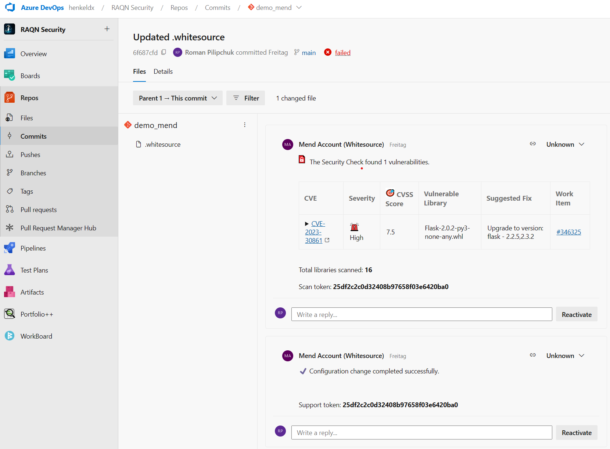

# Mend Integration for Production Branches - via Mend Repository Integration

The following steps have to be done to integrate Mend for the production branches via the Mend repository integration:

### Part 1 (only required once per Azure project)

- **(1) Get Approal**: Ask the DevSecOps team (devsecops@henkel.com) for approval to integrate Mend as licenses are currently limited
- **(2) Add Service Account to Azure Project**: An admin of the Azure project has to add the Mend service account (mend_sa@henkel.com) to the project as an admin
  - Open your project in Azure > Go to "Project Settings" > "Overview" > Under "Project Administrators" click the Button "Add Administrator" > search for "mend_sa@henkel.com" > click "Add"
- **(3) Start Sync Projects in Mend (not always required)**: The DevSecOps team has to start the sync of new projects in order for Mend to generate required pull requests in the project. Sometimes Mend does this automatically. You can continue with the next steps while asking the DevSecOps team for this step.

### Part 2

- **(4) Find Pull Request for the Repository that requires Mend Integration**: The following repositories require a Mend integration: repos containing source code of a) active application or b) applications that will go live in the future. 
  - Open your project in Azure > Go to "Repos" > "Pull Requests" > Select your repository > open "Active" > You should find a pull request named "Configure Mend for Azure Repos" if not look under the other tabs.
  
- **(5) Check if adapation of the ".whitesource" File is required for the Repository**

- **5.1) In case the Default Branch is NOT Production Branch**: adjust the configuration of the .whitesource file from the pull request as follows and replace *NameOfProdBranch* with the name of the prod branch like *main* or *master*.

````yaml
{
  "settingsInheritedFrom": "whitesource-config/whitesource-config@main",
   "scanSettings": {
    "baseBranches": ["NameOfProdBranch"]
    }
}
````

- **5.2) In case you are using Azure Artifact Feeds in the repository**: it is IMPORTANT, to add certain parameters to the .whitesource file. Please contact DevSecOps@henkel.com 
to receive the specific parameters as they have to be crafted individually. If you want, you can continue with the other steps and merge the PR and complete this step afterwards.


- **5.3) In case you are Togther with Other Teams in the same Azure Project**: adjust the configuration of the .whitesource file from the pull request as follows and replace *Label1* from *Mend Label1* with name you want to set as a tag for work items created by Mend.

````yaml
{
  "settingsInheritedFrom": "whitesource-config/whitesource-config@main",
   "issueSettings": {
    "customLabels": ["Mend Label1"]
    }
}
````

- **5.4) In case you want to customize Fields of Work Items created by Mend**: adjust the configuration of the .whitesource file from the pull request as sown in the following example, 
by adding work item field names and values under the "customFields" section. 
**IMPORTANT: Changes of Mend "customFields" are only applied to newly created work items by Mend. Thus, to apply to exiting ones, they have to be deleted! Also check/delete closed work items in case they are reopened!**
[Find Mend Documentation here under section "Issue Settings (issueSettings)" Parameter "customFields".](https://docs.mend.io/bundle/integrations/page/configure_mend_for_azure_repos_for_sca.html)

````yaml
{
  "settingsInheritedFrom": "whitesource-config/whitesource-config@main",
  "issueSettings": {
    "customFields": {
      "Assigned To": "roman.pilipchuk@henkel.com",
      "Iteration Path": "RAQN Security\\Sprint 2024 Q2.3",
      "Area Path": "test-2\\Area1\\SubArea1",
      "Priority": 1
    }
  }
}
````

Example task if 5.1), 5.3) and 5.4) applies to your project:

````yaml
{
  "settingsInheritedFrom": "whitesource-config/whitesource-config@main",
    "scanSettings": {
      "baseBranches": ["NameOfProdBranch"]
    },
    "issueSettings": {
      "customLabels": ["Mend Label1"]
    },
    "issueSettings": {
      "customFields": {
        "Assigned To": "roman.pilipchuk@henkel.com",
        "Iteration Path": "RAQN Security\\Sprint 2024 Q2.3",
        "Area Path": "test-2\\Area1\\SubArea1",
        "Priority": 1
      }
    }
}
````


- **(6) Accept the Pull Request for the Repository:** has to be merged to the default branch of your repository.

- **(7) Check if Change of Mend Repository Integration was successfull**: 
a) Check under the commit of the updated whitesource file that the configuration change was successfull "Configuration change completed successfully." and 
b) Check that in the Mend UI a new entry is generated for you repository ([Link to Mend](https://saas-eu.whitesourcesoftware.com/Wss/WSS.html#!home;orgToken=ba91b79a-9a90-41be-b34f-edfbece447a9) > open in the top left the Mend organization "Henkel_Prod_RepoIntegration" > find and click your Azure project name > find your repository name).



- **(8) Write DevSecOps Team to adjust the new Entry in Mend UI**: Please write the DevSecOps Team (devsecops@henkel.com) so that we can adjust the generated entries in the Mend UI to have them under in the correct Mend Product.


