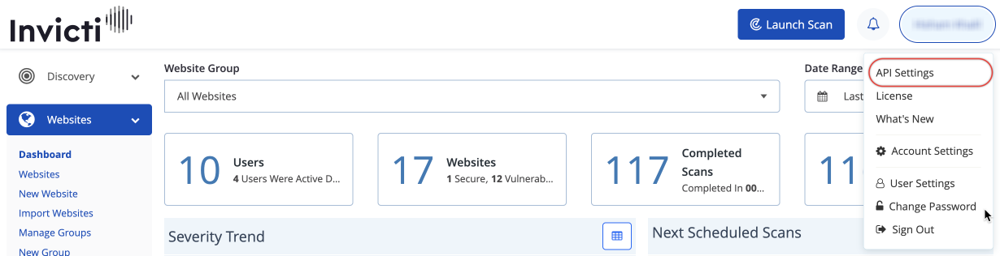
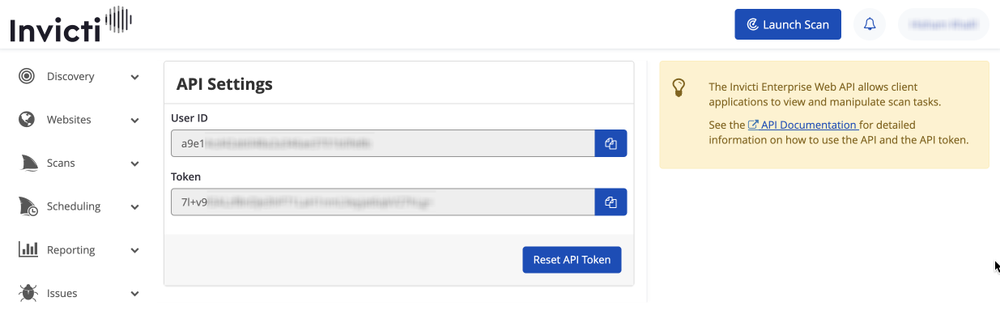
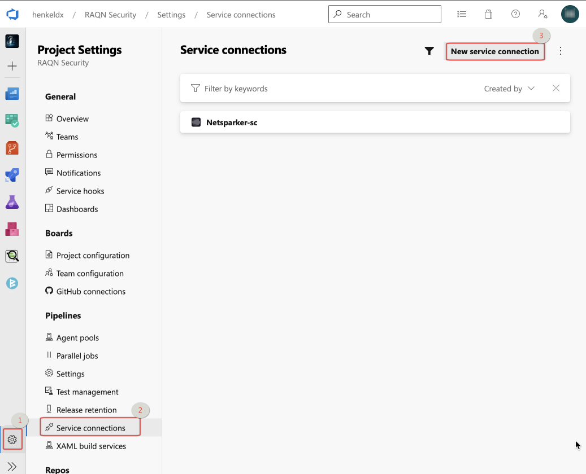
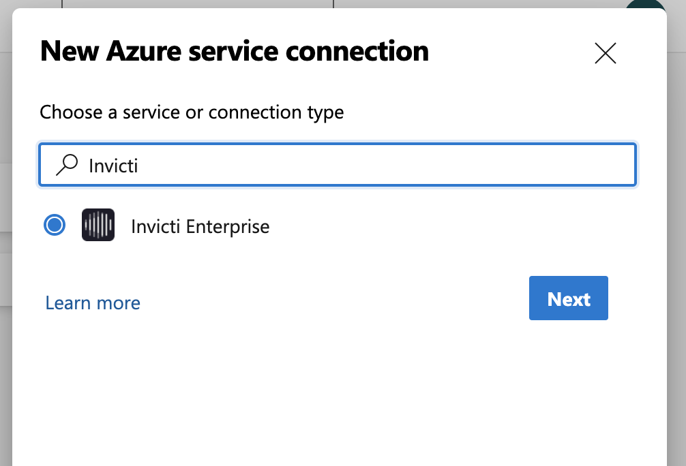

# Netsparker integration guideline

## 1. Netsparker description + utilization (CICD + target definition)

### 1.1 Description
Netsparker is a tool that enables Henkel to scan websites, applications and APIs for security vulnerabilities. It can be fully automated and comes with strong CICD integration capabilities for Azure DevOps. 
Following sections explain how to integrate with Netsparker, how to configure scans on different tech stacks and what to prepare at the targeted app, website or API service.
### 1.2 Target definition + selection
Henkel pays per “target”, which means for the teams to carefully select the scan destination and keep the target and its address stable. 
A “Target” is defined as a fully qualified domain name (FQDN, e.g., myhost.example-domain.com), with hosts and IP ports that need to be considered.


| These examples are considered to be 1 target, as they share the same FQDN, do not vary in hosts or ports and differ only in the protocol used (http or https): | These examples are considered different targets, because hosts or ports vary while they share the same domain: |
|--|--|
| •	http://example.com, https://example.com, http://www.example.com, http://www.example.com/test	 | •	http://example.com, http://test.example.com, http://example.com:81|

## 2. Integration and Configuration

### 2.1 Integration

To establish a connection between Azure Devops and Netsparker (Invicti), you need to create a Netsparker Service connection in Azure DevOps.
First, you need to generate an API user ID and token on Netsparker platform and use them as credentials for the Service connection. 
To do this, go to the [netsparker (Invicti)](https://eu.netsparker.cloud/websites/globaldashboard/) platform and click on the username (ado_netsparker) in the top right corner and select "API Settings". You will be redirected to the API settings page.

> :warning:  **Note: For the user ado_netsparker (system user) a user id and token have already been created and will be reused**. Please ask the DevSecOps team for the Credentials.

Copy the "User ID" and "Token" and navigate to your target project in Azure DevOps.
Under the project settings, select "Service Connection" and then "New service connection" as shown below.

In the popup dialog search for "Invicti Enterprise" and click "Next"

Fill in the credentials you copied from the Netsparker platform and choose a name for the service connection. Finally, click on "Save".


Once the service connection is created, you can use it in the pipeline as follows.

### pipeline configuration: 

Go to the target pipeline and add the following lines there: 
```
- task: netsparker-cloud@1
  displayName: 'DAST - Netsparker Scan'
  inputs:
    apiConnection: 'Netsparker'
    scanTypes: '2'
    scanWebSites: 'website ID'
    scanWebSitesProfile: 'ScanProfile ID'
    hasReport: true
    reportType: 'ScanDetail'
```
So we need some parameters here and they are: 
```apiConnection``` the name of the connection that we created in the previous step. 
```scanTypes``` is 0 = incremental, 1= full (with primary profile) and 2 = full(with selected profile) 
```scanWebSites``` is the ID of the website that you defined on the Netsparker side. by clicking on the website name in the Netsparker panel you can find it. 

Before jumping to the pipeline config YAML, we need to define the website and scan within the Netsparker platform.


### 2.2 Configuration for different tech stacks
Assuming most projects rely on the Henkel target tech stack (angular, nodejs, javascript…), following configurations help to construct an effective scan profile:

```Built-in Scan Policies:``` [Overview of Scan Policies | Invicti](https://www.invicti.com/support/scan-policies-invicti/)
```Scan Single-Page-Applications:``` [Scanning Single Page Applications | Invicti](https://www.invicti.com/support/scanning-single-page-applications/#configuring-the-netsparker-javascript-analyzer)
```Scan RESTful API:```[Scanning a RESTful API Web Service | Invicti](https://www.invicti.com/support/scanning-restful-api-web-service/)

*Targets that require authentication:**
```Username + PW:``` [Configuring and Verifying Form Authentication in Invicti Enterprise | Invicti](https://www.invicti.com/support/configuring-verifying-form-authentication-invicti-enterprise/)
```OTP:``` [Configuring and Verifying Form Authentication in Invicti Enterprise | Invicti](https://www.invicti.com/support/configuring-verifying-form-authentication-invicti-enterprise/#configuring-form-authentication-otp)
```Henkel internal (certificate based):``` [Configuring Client Certificate Authentication | Invicti](https://www.invicti.com/support/configuring-client-certificate-authentication/)

### 2.3 Recommended best practice
dxS collected certain best practices that shall be adopted by the projects. 

These are:

Split pipelines into build and deployment:
Not every code commit or test if the application builds successfully has to result in a Netsparker scan. Therefore the code change can take place in a dedicated build pipeline.

Those changes to an application that are soon to be deployed to production environment need to be scanned before.

Therefore, Netsparker could be started in a follow up deployment pipeline, running against a running app in a dev or test environment.

Set a breakpoint to the pipeline if vulnerabilities are discovered:
```
buildFail: true
severity: 'Critical'
isConfirmed: true
ignoreFalsePositive: true
ignoreRiskAccepted: true
stopScan: true
```

More Info

https://docs.henkelgroup.cloud/security/DevSecOps/netsparker/ 
https://www.netsparker.com/support/integrating-netsparker-enterprise-azure-pipelines/#using-build-fail-azure-pipelines 
## 3 Corporate Standards & vulnerability mitigation

Corporate Standard Information & Cyber Security (CSIS/) requires asset owners to carry out adequate testing when developing software (CSIS) and to fix detected + confirmed vulnerabilities timely.

_CSIS sections 8.6.1 and 10.2.7_ point to two crucial sections for security within software development activities.

### Vulnerability mitigation

Please check [here](remediation.md) how to get scan results and fix them.

As per Corporate Standard Cyber Security (Section 8.6.1) following remediation timeframes must be followed:


| **Severity** | **Requirement for remediation**  |
|--|--|
| **Critical vulnerabilities** | (CVSS  base score typically 9-10, i.e., if exploitation could allow code execution without user interaction) must be remediated within 72 hours after detection or following an agreed upon action plan. Ideally, critical vulnerabilities should be remediated within 24 hours after detection. Exceptions require CISO & CDIO approval. |
| **Important vulnerabilities** | (CVSS base score typically 7.0-8.9, i.e., if exploitation could result in compromise of the confidentiality, integrity, or availability of Henkel data, or of the integrity or availability of processing resources) must be remediated within 30 days after detection or following an agreed upon action plan. Exceptions require SOC approval for deviations and CISO approval for risk acceptances. |
| **Moderate vulnerabilities** | (CVSS base score typically 4.0-6.9, i.e., if the impact of the vulnerability is limited, or the likelihood of exploitation is low e.g. due to authentication requirements) must be remediated within 90 days after detection. Exceptions require SOC approval. |
| **Low vulnerabilities**  | (CVSS base score typically 0.1 – 3.9, i.e. if Impact of the vulnerability is comprehensively mitigated by the characteristics of the affected component) must be remediated within 180 days after detection. Exceptions require SOC approval. |

A confirmed existing vulnerability with a CVSS score >= 7.0 is currently being discussed to be a quality gate for security. A vulnerability with that score needs immediate remediation, and pipelines should not allow these vulnerabilities to make it into production.
So prepare for these kind of enforcements early by mitigating vulnerabilities and involve dxS for needed consultation.

```yaml
- task: netsparker-cloud@1
  displayName: 'DAST - NetSparker Scan'
  inputs:
    apiConnection: 'NetSparker'
    scanTypes: 'Scan type id'
    scanWebSites: 'website scan id'
    scanWebSitesProfile: 'scan profile id'
```

- ```apiConnection``` is an Azure DevOps connection, should be config from Azure DevOps project settings / Service connections.   

- ```scanTypes```  is the id of kind of 3 types of scan, which are as follows:
  + 0 = incremental 
  + 1 = Full (with primary profile)
  + 2 = Full (with selected profile)    


- ```scanWebSites``` is the predefined target website, should be defined in the Netsparker dashboard. [New website](https://eu.netsparker.cloud/websites/new/)  

- ```scanWebSitesProfile``` is the predefined scan profile, should be defined in the Netsparker dashboard. [Scan Profiles](https://eu.netsparker.cloud/scans/scanprofiles/)  

Before jumping to config YAML, we need to define the website and scan the profile in the Netsparker dashboard. 