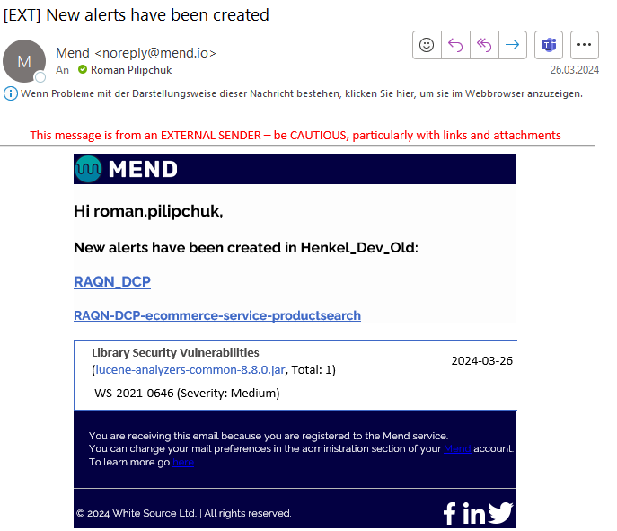
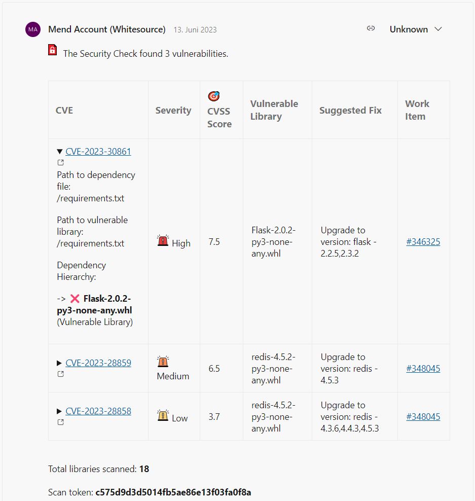
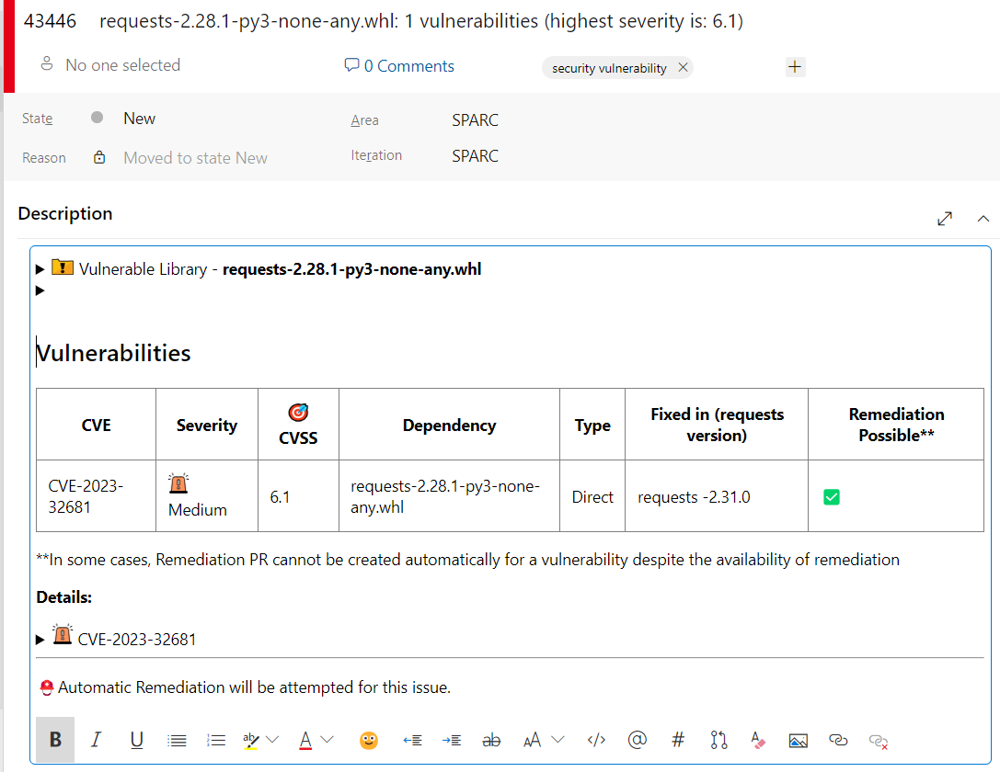
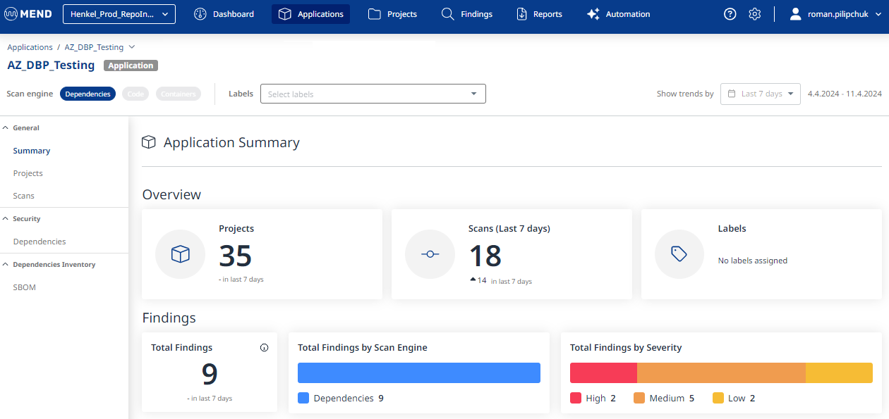
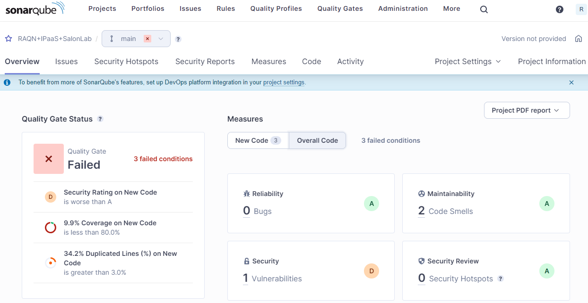
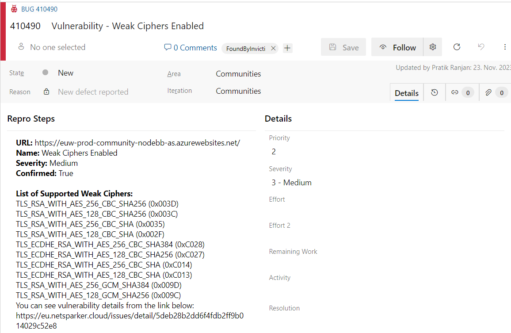
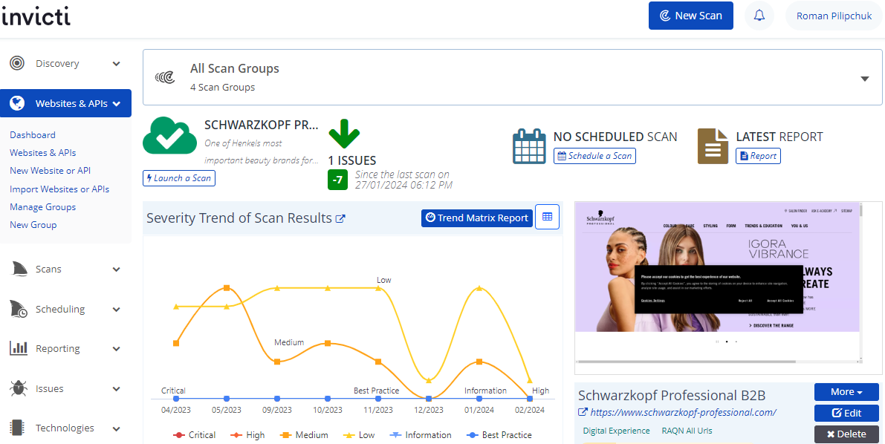

# CSIS Remediation Policy

| **Severity** | SonarQube Severity | CVSS  | **Requirement for remediation**  |
|--|--|--|--|
| **Critical vulnerabilities** | Blocker | 9-10  | Must be remediated **within 72 hours** (if possible even within 24 hours) or following an agreed upon action plan. (Critical vulnerabilities if exploitated could allow arbitrary code execution)  |
| **High/Important vulnerabilities** | Critical | 7.0-8.9   | Must be remediated **within 30 days** or following an agreed upon action plan.  (High vulnerabilties if exploitation could result in compromise of confidentiality, integrity, or availability of Henkel data and processing resources) |
| **Medium/Moderate vulnerabilities** | Major | 4.0-6.9   | Must be remediated **within 90 days** |
| **Low vulnerabilities**  | Minor and Info | 0.1 – 3.9  | Must be remediated **within 180 days**  |

As per [CSIS](https://henkelgroup.sharepoint.com/:w:/r/teams/InformationSecurity/CSIS/_layouts/15/Doc.aspx?sourcedoc=%7B4E8D5E9B-3451-4566-879D-34889FA2B7E2%7D&file=CS_Information-Cyber-Security.docx&action=default&mobileredirect=true)

# Recommendations for Establishing Continous Vulnerability Remediation Process
It is important for Dev. Teams / App Owners to establish on their side a continuous process for vulnerability remediation with the security scanners Mend, SonarQube and Netsparker as only by this 
they can hold the CSIS remediation deadlines for fixing vulnerabilities. 
Therefore, we recommend using all supporting features (e.g. email notification, work item creation) that the different scanners offer to be always informed on new vulnerabilities in order to plan 
their remediation compliant with CSIS remediation deadlines.

## Table of Contents

- [General Information on Vulnerability Remediation and Prioritization](https://docs.henkelgroup.cloud/security/DevSecOps/remediation/#general-information-on-vulnerability-remediation-and-prioritization)
- [Vulnerability Management Process](https://docs.henkelgroup.cloud/security/DevSecOps/remediation/#vulnerability-management-process)
- [What to do if CSIS deadline can not be hold?](https://docs.henkelgroup.cloud/security/DevSecOps/remediation/#what-to-do-if-csis-deadline-can-not-be-hold)
- [What to do if a vulnerability (especially in Mend) has no Fix?](https://docs.henkelgroup.cloud/security/DevSecOps/remediation/#what-to-do-if-a-vulnerability-especially-in-mend-has-no-fix)
- [Mend Vulnerability Information](https://docs.henkelgroup.cloud/security/DevSecOps/remediation/#mend-monitoring-vulnerability-information)
- [SonarQube Vulnerability Information](https://docs.henkelgroup.cloud/security/DevSecOps/remediation/#sonarqube-monitoring-vulnerability-information)
- [Netsparker Vulnerability Information](https://docs.henkelgroup.cloud/security/DevSecOps/remediation/#netsparker-monitoring-vulnerability-information)

## General Information on Vulnerability Remediation and Prioritization

**Definition of "Vulnerability Remediated"**: means that fixed code is release to production

**Prioritization of Vulnerabilities:** 

- **First, based on the public exposure** of the affected application: publicly accessible applications to be prioritized.
- **Second, based on the severitiy** of the vulnerabilitiy: 1. Critical, 2. High, 3. Medium, 4. Low.

**Vulnerability Remediation in Production Environment:**

- **Critical Vulnerability:** React and fix immediately as extremely dangerous and to be remediated in 72h.
- **High/Medium/Low Vulnerability:** Can be planed as part of sprints in compliance with the CSIS remediation deadlines 30d/90d/180d. 

**Vulnerabilities Remediation in Non-Production Environments:** 

- Remediate these vulnerabilites at best directly during coding or on pull requests to a selected enironment (e.g. QA environment) or latest on pull requests to 
  the production branch (meaning before releasing code to production). The earlier a vulnerabiltiy is remediated the easier it is to remediate, as in later steps dependencies 
  might break code functionality.

## Vulnerability Management Process
Each security scanner provides different features for montoring vulnerability information and receiving notifications. These features impact how you can shape your vulnerability management 
process. 

**1) Vulnerabilities in Production Environments found by Mend, SonarQube or Netsparker**

1. **Define Roles and Responsibilities**:

  - **Monitoring Responsibility:** Define one ore more dedicated people who are responsible to monitor vulnerabilities and create/organize work items for vulnerabilities. Afterwards, define with 
   these people how they will monitor vulnerabilities for each scanner. Therefore, have a look in the overview of features each scanner provides in sections [Mend Vulnerability Information](https://docs.henkelgroup.cloud/security/DevSecOps/remediation/#mend-monitoring-vulnerability-information), 
   [SonarQube Vulnerability Information](https://docs.henkelgroup.cloud/security/DevSecOps/remediation/#sonarqube-monitoring-vulnerability-information) and 
   [Netsparker Vulnerability Information](https://docs.henkelgroup.cloud/security/DevSecOps/remediation/#netsparker-monitoring-vulnerability-information).
  
  - **Remediation Responsibility:** Define who is responsible to fix vulnerabilities for which repositories and how they will get the task to fix certain vulnerabilities. 

2. **Define Vuln Mgmt Process I - Vulnerabilities in Production Environemnts found by Mend, SonarQube or Netsparker:** 
    
  - The person responsible to monitor vulnerabilities in the prodcution environment monitors them in a defined way based on the features each scanner provides.
  - When a new vulnerability emerges, this person checks the severity.
  - a) If it is a critical vulnerability:
    - The person responsible to fix the vulnerability is notified directly and this person starts immediatly to remediate the vulnerabiltiy.
  - b) If it is a high, medium or low vulnerability: 
    - The person responsible to monitor vulnerabilities plans the remediation as part of the upcoming sprints, while complying to the CSIS remediaiton deadlines. Therefore, either the generated
     work items created by the security scanners are used or new work items are generated. 

**2) Vulnerabilities in Non-Production Environments found by Mend, SonarQube**

1. **Define Roles and Responsibilities**:

  - **Remediation Responsibility:** Define an environment (e.g. QA environment) to which no new vulnerabilities are allowed to be pushed as part of pull requests. Afterwards, define that people
   who are creating pull requests to this environment are responsible to fix any newly introduced vulnerability. To enforce this, measures like branch policies can be utilized.

2. **Define Vuln Mgmt Process II - Vulnerabilities in Non-Production Environments found by Mend, SonarQube:** 

  - A person, that had written new code, creates a pull request to the enivonrment to which no new vulnerabiliites are allowed to be pushed as part of pull requests.
  - Upon creating the pull request security scanners are triggered scanning the branch.
  - Based on the vulnerability results the person has to fix any newly introduced vulnerability before completing the pull request.

## What to do if CSIS deadline can not be hold?

- **If CSIS remediation deadline cannot be hold:** Notify devsecops@henkel.com, latest on the last day of the deadline, about respective repository, vulnerability, reason for delay and 
  planned remediation date (soon as possible)

## What to do if a vulnerability (especially in Mend) has no Fix?
If a vulnerability in a 3rd party library can not be fixed because there is no update for the library available we recommend the following:

1. **Look in the vendor advisory** of the affected library (e.g. project repository, forums) for information on that vulnerability **to find potential workarounds or when an update might be available**.
  
  - Check whether the library is still actively worked on.
  - Additional information and supporting links can be found in Mend when clicking on the vulnerable root library.
  - Sometimes it is possible to update a vulnerable transitive library in a library you are using by yourself.
  - In case no updates will come search for an alternative library with active community.
  - In case no updates will come and only small part of the library is used (e.g. 1 function) it is possible to download it and remediate the vulnerability yourself.

2. **If no advisory is present get in contact with the vendor** 

3. **Assess the potential impact of the vulnerability for your application**

  - Look up EAM cyber risk category and cyber risk classification for your application.
  - Consider the sensitivity of data and business criticality of the application. Which sensitive or business critical data can be stolen? How is the business affected if the application would be taken down / over?
  - Consider who can access the application e.g. everybody from the internet or only certain groups or only whitelisted IPs.

4. **If you belong to the critical projects (RAQN, IPaaS and HDP) that are supported by the dxS DevSecOps team reach out to DevSecOps@henkel.com** and provide collected information from
the previous points as well as the affected repository, library and vulnerability.

  - The DevSecOps team will provide further guidance and support to understand the risk for your application and Henkel. This includes for example, support to find a workaround or 
   assess the necessity to exchange the affected library if there is no active development.

## Mend Monitoring Vulnerability Information
Plan remediation of vulnerabilities based on automatic emails from Mend and work items created by Mend in Azure DevOps. 

Different to SonarQube and Netsparker, for Mend it is normal that new vulnerabilities can be reported for a repository even if no code changes nor new scans were done.
This is the case as for a library that is clasified secure today tomorrow a new vulnerability can be published in a vulnerability database.

**Vulnerability Information and Notifications:**

- **Email Notifications:** Mend is sending email notifications for any newly found vulnerability in a repository. Use these notifications to manage remediation depending 
  on their severity. For example, you can create 2 email folders. One for critical vulnerabilities and one for the others (high, medium and low). This will empower you to directly 
  see any new critical vulnerability and react immediately.

- **Azure DevOps - Commits:** For every branch Mend is showing in each commit all found vulnerabilities. This can be used to monitor vulnerabilities during development and in pull requests.

- **Azure DevOps - Work Items:** Mend is generating work items for each directly imported library that contains vulnerabilities. These can be used to plan vulnerability remediation as 
  part of the scrum process.

- **Mend UI - Organization "Henkel_Prod_RepoIntegration":** Here Mend is showing the latest results of vulnerabilities for the production branch of a repository. This can be used to 
  plan vulnerability remediation as part of the scrum process.

- **Mend UI - Organization "Henkel_Dev":** Here Mend is showing the latest results of vulnerabilities for each branch on which a piepeline with a Mend task is run. This can be used by developers 
  to understand the amount of vulnerabilities in a development branch.

## SonarQube Monitoring Vulnerability Information
As SonarQue has no automatic notification on vulnerabilitis, it is recommended to plan manual monitoring steps to monitor and remediate vulnerabilities.

**Vulnerability Information:**

- **SonarQube UI:** SonarQube is showing the latest results of vulnerabilities for production as well as other branches on whith a pipeline with a SonarQube Task is run. This can be used to 
  plan vulnerability remediation as part of the scrum process.

## Netsparker Monitoring Vulnerability Information
Plan remediation of vulnerabilities based on automatic emails from Netsparker and work items created by Netsparker in Azure DevOps. 

Currently, Netsparker scans only the production URLs / APIs.

**Vulnerability Information and Notifications:**

- **Email Notifications:** Netsparker is sending a vulnerability report for a scanned URL via email. This can be used to 
  plan vulnerability remediation as part of the scrum process.

- **Azure DevOps - Work Items:** Netsparker is generating work items for each vulnerability. These can be used to plan vulnerability remediation as 
  part of the scrum process.

- **Netsparker UI:** Here Netsparker is showing the latest results of vulnerabilities for the scanned production URL / API. This can be used to plan vulnerability remediation as 
  part of the scrum process.

