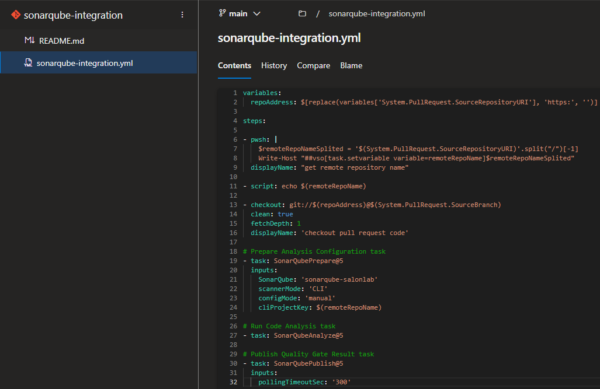
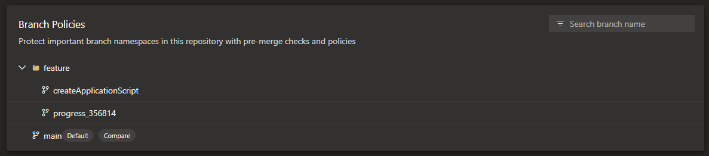
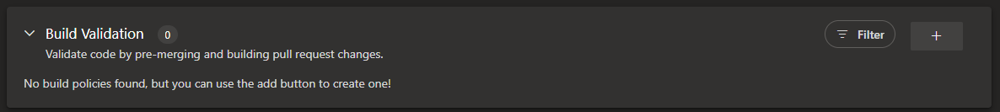
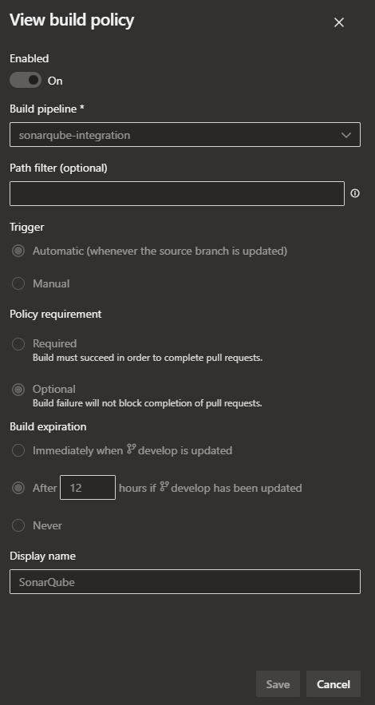

By setting up Branch Policies you can ensure that every commit into the branch (you set it up for) will be scanned by SonarQube.

**Steps**

- Create new repository with a sonarqube-pipeline (see below), which will be later referred to as "sonarqube-pipeline" in this documentation

  - Create a repository e.g. "sonarqube-integration"
  - Create a .yml file in this repository e.g. "sonarqube-integration.yml" (find Code Snippet below)
    - [Here](https://dev.azure.com/henkeldx/SalonLab/_git/sonarqube-integration?path=/sonarqube-integration.yml) you can find an example



```yml
variables:
  repoAddress: $[replace(variables['System.PullRequest.SourceRepositoryURI'], 'https:', '')]

steps:

- pwsh: |
    $remoteRepoNameSplited = '$(System.PullRequest.SourceRepositoryURI)'.split("/")[-1]
    Write-Host "##vso[task.setvariable variable=remoteRepoName]$remoteRepoNameSplited"
  displayName: "get remote repository name"

- script: echo $(remoteRepoName)

- checkout: git://$(repoAddress)@$(System.PullRequest.SourceBranch)
  clean: true
  fetchDepth: 1
  displayName: 'checkout pull request code'

# Prepare Analysis Configuration task
- task: SonarQubePrepare@5
  inputs:
    SonarQube: 'sonarqube-salonlab'
    scannerMode: 'CLI'
    configMode: 'manual'
    cliProjectKey: $(remoteRepoName)

# Run Code Analysis task
- task: SonarQubeAnalyze@5

# Publish Quality Gate Result task
- task: SonarQubePublish@5
  inputs:
    pollingTimeoutSec: '300'
```


- Set up Branch Policies:
  - "Project Settings" -> "Repositories" -> Search the repository for which you want to set up the Branch Policy -> Navigate to "Policies" -> Pick the branch you want it to be set up for (most times it is the production branch) (see Screen below)



- After you picked your branch you scroll down to "Build Validation"



- Click on the "+" to create the Branch Policy

  - "Build Pipeline" : Your sonarqube-pipeline which you created in the first step
  - "Path filter" : leave empty
  - "Trigger" : Choose "Automatic"
  - "Policy Requirement" : Choose "Optional" (Even if the SonarQube Pipeline has Problems/ is not working, the Pull Request will not fail)
  - "Build expiration" : Choose "After 12 hours if develop has been updated"
  - "Display Name" : Enter "SonarQube"
  - Click "Save"



- Every Pull Request for a merge into the branch you just set up the Branch Policy for in the last step will now be scanned by SonarQube
- You can create Branch Policies for as many repositories/branches you want using the "Build Pipeline" you created in step one
