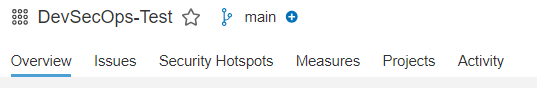
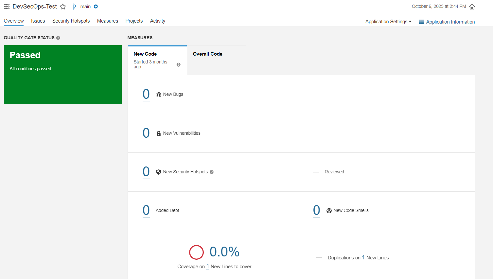
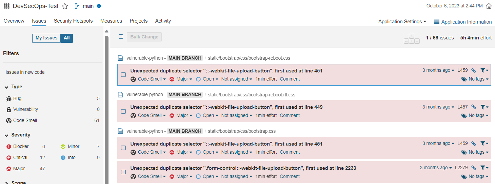

Here you can find a short Intro to SonarQube with a focus on what is interesting for Developers.

In this case we will look at the "main" branch, if your commit/ scan was in another branch do not forget to change it (by clicking on "main" in this example)

**Overview**

In the Overview of your Project in SonarQube you can see following information:

* Information about the New Code (Bugs / Vulnerabilities / Security Hotspots / Code Smells etc.)

* Also you get a hint of SonarQube approves the overall state of your project (see the green "Passed" on the top left, if SonarQube is unsatisfied it says "Failed" in red color)

* By clicking on "Overall Code" you see the same data for "New Code" but for all lines of code

**Issues**

In the Issues Tab of your Project you can see detailed information about your issues.

* By clicking on a issue you can even see more details about this specific one

* Really helpful is the info "x min effort" matched to each issue, which gives gives you information on how long the fix will take

* These data can be useful for vulnerability remediation, especially "Issues" and "Security Hotspot"

**Vulnerability Remediation**

*  "Blocker" (Critical) - The utmost Priority Vulnerabilities which needs to be fixed within 72 hours.

*  "Major" (Hight) - Needs to be fixed in 15 Days
*  "Minor" (Medium) and "Info" (Informational) 60 and 90 Days Respectively

All the Remediation dates will be counted from Creation date of the Vulnerability.