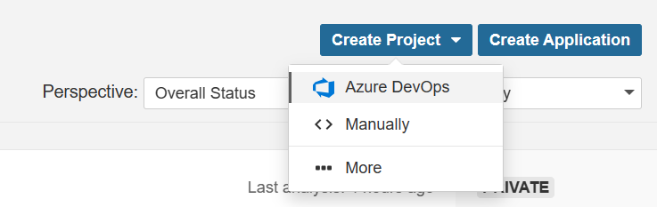
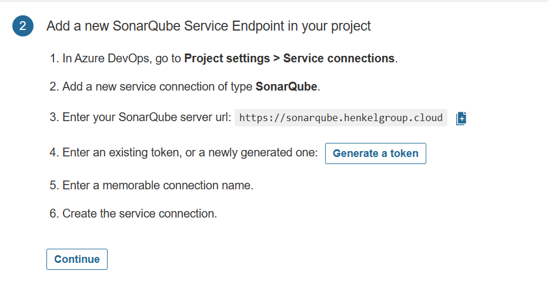
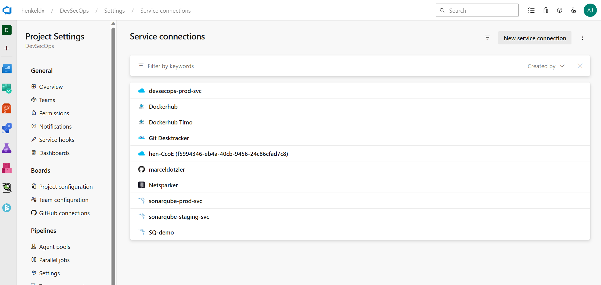
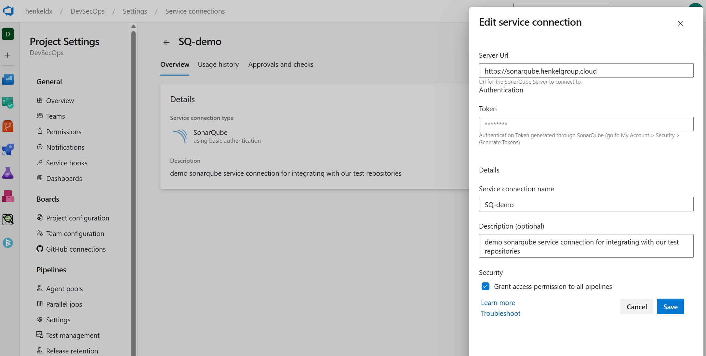

#Onboard SonarQube

## Prerequisite

Install SonarQube extension for Azure DevOps
From your Azure DevOps instance, navigate to the Visual Studio Marketplace and install the SonarQube extension by clicking the Get it free button.
https://marketplace.visualstudio.com/items?itemName=SonarSource.sonarqube

## Installation

1. Invite ado_sonarqube@henkel.com to your project members
2. Request token from the devsecops team.
3. Open SonarQube and create a new project (Create Project -> Azure DevOps)
4. Select Repository



## Integration:



For each project you need at least one service connection:


Example service connection:


Example for Python, Go, Javascript, Typescript, etc.

````yaml
trigger:
- master # or the name of your main branch
- feature/*

steps:
# Prepare Analysis Configuration task
- task: SonarQubePrepare@5
  inputs:
    SonarQube: 'YourSonarqubeServerEndpoint'
    scannerMode: 'CLI'
    configMode: 'manual'
    cliProjectKey: 'YourProjectKey'

# Run Code Analysis task
- task: SonarQubeAnalyze@5

# Publish Quality Gate Result task
- task: SonarQubePublish@5
  inputs:
    pollingTimeoutSec: '300'
````

Real live example:
````yaml
# Prepare Analysis Configuration task
- task: SonarQubePrepare@5
  inputs:
    SonarQube: 'SQ-demo'
    scannerMode: 'CLI'
    configMode: 'manual'
    cliProjectKey: 'DevSecOps_vulnerable-python_AYk_w1iBxp0V-uA7Ukyh'

# Run Code Analysis task
- task: SonarQubeAnalyze@5

# Publish Quality Gate Result task
- task: SonarQubePublish@5
  inputs:
    pollingTimeoutSec: '300'
````

Parameter description:

|Parameter| Description |
|--|--|
| SonarQube | Required. name of the service account |
| scannerMode | Required. Choose the way to run the analysis. Default: MSBuild. |
| configMode | Optional. Use when scannerMode = CLI && configMode = file. Settings File. Default: sonar-project.properties. |
| cliProjectKey | Required when scannerMode = CLI && configMode = manual. Project Key found in SonarQube |
| pollingTimeoutSec | Required. Timeout (s). Default: 300 |

Full task documentation:

SonarQubePrepare@5
https://learn.microsoft.com/en-us/azure/devops/pipelines/tasks/reference/sonar-qube-prepare-v5?view=azure-pipelines

SonarQubeAnalyze@5
https://learn.microsoft.com/en-us/azure/devops/pipelines/tasks/reference/sonar-qube-analyze-v5?view=azure-pipelines

SonarQubePublish@5
https://learn.microsoft.com/en-us/azure/devops/pipelines/tasks/reference/sonar-qube-publish-v5?view=azure-pipelines
