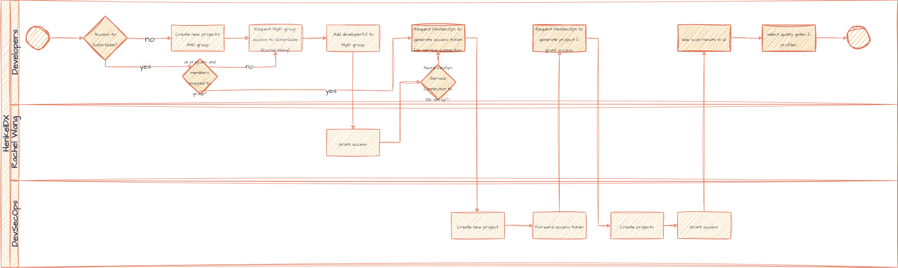

# Get Access for SonarQube

**Steps**

* Check if you already have access to SonarQube
* If no Access: Create a new MyID group, add developers to the group and request access by Rachel Wang
* By default, newly onboarded users do not see any projects in SonarQube. 
So currently, DevSecOps has to create a new project X and a new group (e.g. SQ-Group-X) within SonarQube and add each member to that group.
* If the developers need a new service connection, create a sample project and send over the token so that the token can be used.
