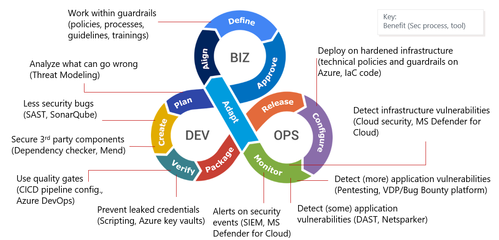
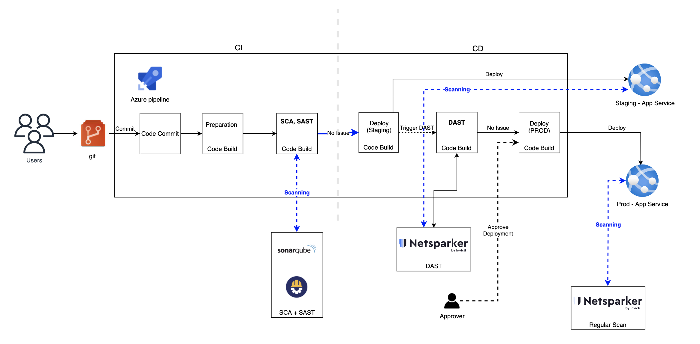
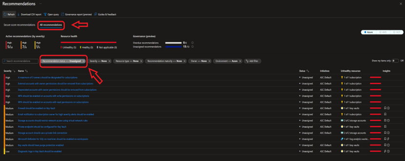
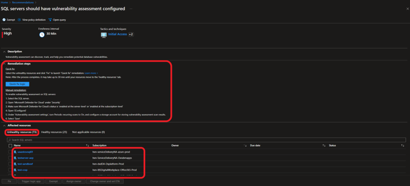

As Shannon Lietz - founder at DevSecOps foundation - said:

> The purpose and intent of DevSecOps is to build on the mindset that
> "everyone is responsible for security" with the goal of safely distributing
> security decisions at speed and scale to those who hold the highest level of
> context without sacrificing the safety required."

# The DevSecOps culture

As you heard before we want to talk about the Shift-left security.
It means we should consider security from design (in a simple definition) and move security earlier in the development process.

Let's suppose that you are working in a DevOps team and you are doing security tests
(yes, at the end of all QA tests and before going to production), what happens?
Well, all bugs should be fixed ASAP, Developer team is under pressure to fix issues,
QA tests should be performed again, and security testing again.

This means that the costs, money and time, increase.
In the end, you sacrifice agility to catch up with things that were missed before.

The solution is introducing security earlier in the process instead of having it in the final steps.
Considering security in design by doing threat modeling and
breaking down huge security tests in smaller security tests. And to integrate them in the development pipeline.

The following picture shows the DevSecOps lifecycles.

---

#### References
- https://github.com/OWASP/DevSecOpsGuideline/blob/master/document/00a-Overview.md

# DevSecOps Tool Stack

To have a good DevSecOps approach in our CI/CD pipeline, we need several tools, and each tool can perform a different sort of scan. To have a better view of the pipeline, let's take a look at the following picture. 

As you can see, we have several stages like SAST, SCA, and DAST. Let's take a deep look at those. 

### SAST: Static Application Security Test
Static Code Analysis or Source Code Analysis is usually part of a Code Review (white-box testing) and it is a method of computer program debugging that is done by examining the code without executing the program.  
Static scanning is a good way to find coding issues such as:​  
+ Syntax violations​
+ Security vulnerabilities​
+ Programming errors​
+ Coding standard violations​
+ Undefined values

We're using **SonarQube** as a SAST solution, [Here](https://docs.henkelgroup.cloud/development/Software-Development-Standards-Guidelines/Security/Security-Tools/#sonarqube) you can find more information. 

### SCA: Software Component/Composition Analysis
Component Analysis is the process of automating application security for managing third-party and open-source components of the codebase. SCA will find any potentially vulnerable components in our codebase to prevent high-security risks like Supply-Chain attacks, not only that but also provide licensing about each component. By doing this, it helps the organization to reduce security risks in their codebase libraries and needed to be early in the modern software development life cycle.

We're using **Mend** as a SCA solution, [Here](whitesource.md) you can find more information. 

### DAST​: Dynamic Application Security Test
DAST is a “Black-Box” testing, can find security vulnerabilities and weaknesses in a running application (through website URL, APIs). It does so by injecting malicious payloads to identify potential flaws that allow for attacks like SQL injections or cross-site scripting (XSS), etc.  
DAST tools are especially helpful for detecting:​  
+ Input or output validation​ (e.g. where client input is obtained and processed)
+ Authentication issues​
+ Server configuration mistakes

We're using **Netsparker** as a DAST solution, [Here](netsparker.md) you can find more information.

### Cloud infrastructure security: MS Defender for Cloud
MS Defender for Cloud is a security monitoring tool that delivers security findings to you as subscription owner.
Alerts and recommendations are displayed and provide guidance for remediation.

Please make sure that the project team observes the security status and acts accordingly in case there are findings:

1. In your subscription, click „Security“ in the navigation pane on the left
2. Click „View additional recommendations in Defender for Cloud“

1. Make sure you select „All recommendations“
2. Set filter „Recommendation status == Unassigned“

1. Click on one of the recommendations („Findings“) 
2. Expand the „Remediation steps“
3. Check your „Unhealthy resources“
