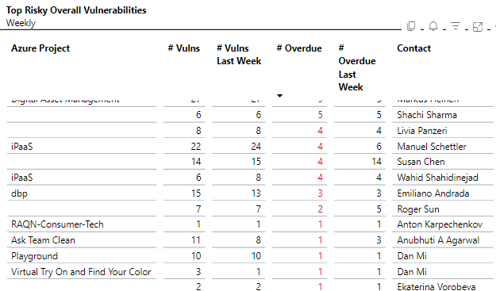
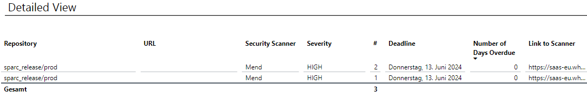
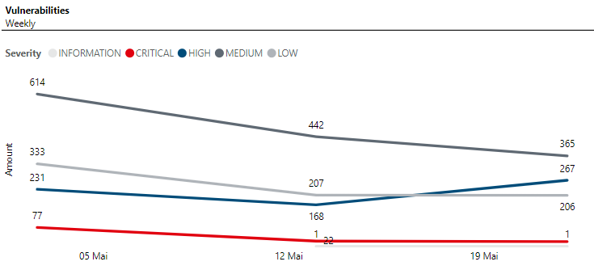
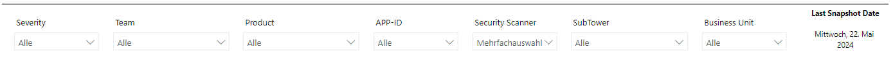

# Vulnerability Dashboard

## Introduction
Our Vulnerability Dashboard is a straightforward way to get an overview over all the current vulnerabilities of projects in our Scope.
Below you will be guided through our Dashboard and its functionalities.

## Most Valuable Features

The current dashboard consists of 3 areas:

1. Filters
2. Graphs
3. Table

Using a filter will change the graphs you are viewing and the data shown in the table. Choosing a row in the table will also change the graphs shown.

### Table

Here you can see the amount of Vulnerabilities which are Overdue (or not) sorted by Team and Application Name. By Clicking on a row you will change the appearance of the graphs field.

**Very Important:** If you want to see a more detailed view and not only the Amount of Vulnerabilities, you have to right click on a specific row and do the "Drilltrough" option.

Here you can see a more detailed view on the vulnerabilities. Which Repository they are in, their severity, the deadline and also if it was already existing in last weeks report.

### Risk KPIs

Here you have a graph which shows the number of vulnerabilities sorted by severity for a specific date. 
Using filters or clicking on specific rows in the table will also change the vulnerabilities shown here. 

### Filters

Here you can select a few filters. Which time you want to have displayed? Which SubTower you want to have displayed? Which Product you want to have displayed?
These filters are dynamic and will change the appearance of the whole dashboard, including graphs and the table.

*Disclaimer:* The date shown in the top left of the dashboard is the date of the last upload of data. All data shown in the dashboard (Number of Vulnerabilities, Overdue dates, etc.) will be counted refering to the "Current Upload" date.