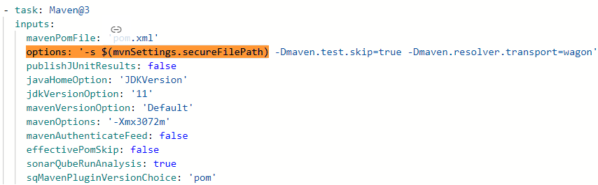

## Java Scanning Best Practices (incl. Scala & Kotlin) (without Mend Prioritize)

[Mend Documentation: Java Scanning Best Practices](https://docs.mend.io/bundle/wsk/page/configuring_the_unified_agent_for_maven.html)

```yaml
MEND UNIFIED AGENT (Linux) - FOR MAVEN:

- script: |
    echo Downloading Mend Unified Agent
    curl -LJO https://unified-agent.s3.amazonaws.com/wss-unified-agent.jar
    if [[ "$(curl -sL https://unified-agent.s3.amazonaws.com/wss-unified-agent.jar.sha256)" != "$(sha256sum wss-unified-agent.jar)" ]] ; then
      echo "Integrity Check Failed"
    else
      echo "Integrity Check Passed"
      echo Starting Mend Scan
      java -jar wss-unified-agent.jar -logLevel debug  # java -jar wss-unified-agent.jar -logLevel debug
    fi
  displayName: 'Mend Unified Agent Security Scan'
  env:
    WS_APIKEY: $(OrgKey-Henkel_Dev)
    WS_USERKEY: $(UserKey-ServiceUser_Henkel_Dev)
    WS_WSS_URL: https://saas-eu.whitesourcesoftware.com/agent
    WS_PRODUCTNAME: # Set your entry from the linked list below!
    WS_PROJECTNAME: $(Build.Repository.Name)_$(Build.SourceBranchName)
    WS_FILESYSTEMSCAN: false
    WS_RESOLVEALLDEPENDENCIES: false
    WS_HTML_RESOLVEDEPENDENCIES: true
    WS_MAVEN_RESOLVEDEPENDENCIES: true
    WS_MAVEN_IGNOREMVNTREEERRORS: false
    WS_MAVEN_DOWNLOADMISSINGDEPENDENCIES: true
    WS_MAVEN_AGGREGATEMODULES: true
    WS_MAVEN_IGNOREDSCOPES: '["test"]'
```

**Select the respective entry for WS_PRODUCTNAME that fits your team from** [Page: "WS_PRODUCTNAME Entry"](./ws-productname-setup.md). 


### Configuration comments

- **IMPORTANT: Before scanning a Maven project, ensure the following for the most accurate results:**
  - You have Maven installed on the machine on which you are running the Mend scan.
  - **The project dependencies are installed successfully with the package manager on the machine where you are running the scan.**
  - Your project has a pom.xml file available for scanning.
- **IF using Maven task with 'options: -s <PathToMavenSettings>'**
  - If you are using a different path and name to the maven settings xml than the default one, Mend requires the path to this file. For example:
    - 
  - Add the following parameter to your Mend configuration:
    ```yaml
    WS_MAVEN_ADDITIONALARGUMENTS: -s=<PathToMavenSettings>
    ```
    - With regard to the example it would be: "WS_MAVEN_ADDITIONALARGUMENTS: -s=$(mvnSettings.secureFilePath)"
- **IF using several pom files in one repository**
  - If you are using several pom files in one repository and wish to aggreagte results under one Mend entry (this is recommended) add the following parameter to your Mend configuration:
    ```yaml
    WS_MAVEN_AGGREGATEMODULES: true
    ```
- IF envionment path does not match the M2_HOME environment (Should mostly be not the case)
  - Set this parameter to the appropriate value for your environment if the environment path does not match the M2_HOME environment variable:
      ```yaml    
      maven.environmentPath='<Path>'  
      ```
  - Set to the path to .m2 folder, in the case that it is not available in the default location
      ```yaml
      maven.m2RepositoryPath='<Path>'
      ```

- Optional Parameters
  - Set this parameter maven.ignoredScopes to the scopes you wish to ignore. By default, the Unified Agent ignores direct dependencies with scope 'test' and 'provided'. ([see webpage](https://docs.mend.io/bundle/wsk/page/configuring_the_unified_agent_for_maven.html))
  - Set maven.ignoreSourceFiles to 'true' if you wish to ignore source files with extensions such as: ".java", ".class". 
  - Set maven.runPreStep to 'true' unless you have already run 'mvn clean install' on your project prior to the Mend scan.
  - Set maven.projectNameFromDependencyFile to 'true' if you wish for the project name to be taken from the pom.xml's 'artifactId' field. This parameter works only when the maven resolver is the only active resolver ('resolveAllDependencies' is set to 'false').
  - When set failErrorLevel to ‘ALL’, the Unified Agent returns an error code for all errors in the scan. We recommend you keep this parameter set to the default values.
  - Set maven.additionalArguments to the parameters starting with '-' or '--' that you would like to be added to the end of the Maven commands during the scan. For example, -s=path/to/settings.xml.


#### Pipeline Task - Java/Scala POJO
Parameters can be found here: [Mend Documentation: Java Scanning Best Practices](https://docs.mend.io/bundle/wsk/page/configuring_the_unified_agent_for_maven.html).

#### Pipeline Task - Several Programming Languages or Problems with Language Specific Task
If you have several programming languages that need to be scanned in a repository or any problems while executing the language specific Mend task, try the default Mend task with all resolvers enabled and please engage with devsecops@henkel.com to help craft a specifig task for the repository.
 
```yaml
MEND UNIFIED AGENT (Linux) - DEFAULT ALL RESOLVERS & NO FILESYSTEMSCAN:

- script: |
    echo Downloading Mend Unified Agent
    curl -LJO https://unified-agent.s3.amazonaws.com/wss-unified-agent.jar
    if [[ "$(curl -sL https://unified-agent.s3.amazonaws.com/wss-unified-agent.jar.sha256)" != "$(sha256sum wss-unified-agent.jar)" ]] ; then
      echo "Integrity Check Failed"
    else
      echo "Integrity Check Passed"
      echo Starting Mend Scan
      java -jar wss-unified-agent.jar -logLevel debug  # java -jar wss-unified-agent.jar -logLevel debug
    fi
  displayName: 'Mend Unified Agent Security Scan'
  env:
    WS_APIKEY: $(OrgKey-Henkel_Dev)
    WS_USERKEY: $(UserKey-ServiceUser_Henkel_Dev)
    WS_WSS_URL: https://saas-eu.whitesourcesoftware.com/agent  
    WS_PRODUCTNAME: # Set your entry from the list in the top!
    WS_PROJECTNAME: $(Build.Repository.Name)_$(Build.SourceBranchName)
    WS_FILESYSTEMSCAN: false
```


##  Mend Prioritize
Mend Prioritize is a feature that can be activated via config parameters in order to:

- Asses the presence of a vulnerability: Analyzes for each vulnerability whether the vulnerable function of the vulnerale library is called by your code. 
- Identify file and line number of the call: Mend provides a call trace. 

This allows Mend to flag the presence of a vulnerablity according to the following categories:


More information on: [Mend Prioritize](https://docs.mend.io/bundle/sca_user_guide/page/mend_prioritize.html).

### Java Scanning Best Practices (with Mend Prioritize)

The following sections will provide the Mend tasks. Supported languages can be found [here](https://docs.mend.io/bundle/sca_user_guide/page/scanning_projects_with_mend_prioritize.html).

- Oracle JDK (8, 11, or 17)
- OpenJDK (8, 11, or 17)
- Zulu JDK (8, 11, or 17)
- Amazon Corretto (8, 11, or 17

Notes (from Mend):

- If the scanned project is in JDK8, it is possible to use Java 8, Java 11, or Java 17, for the Prioritize scan. If the scanned project is in JDK11, the Prioritize scan must also run with Java 11.0.2 or above in JDK11 (LTS versions only) or JDK 17.
- Project profiles: Maven, Gradle, POJO (Project without Package Manager)
- Supported analysis targets: .jar, .war, .ear

**Important:** To use the Mend Prioritize feature in Java you have to set the Java home variable appropriatly. Therefore, put the following script earyl on in the pipeline e.g. after the maven build.
```yaml
- script: |
    echo "##vso[task.setvariable variable=JAVA_HOME]$(JAVA_HOME_11_X64)"
    echo "##vso[task.setvariable variable=PATH]$(JAVA_HOME_11_X64)/bin:$(PATH)"
  displayName: "Set java version"
```
Adjust the Java version in the above script e.g. for Java 17 set "JAVA_HOME_11" to "Java_Home_17" for both commands. 

#### Pipeline Task - Java/Scala with Maven:
```yaml
MEND UNIFIED AGENT (Linux) - FOR MAVEN:

- script: |
    echo Downloading Mend Unified Agent
    curl -LJO https://unified-agent.s3.amazonaws.com/wss-unified-agent.jar
    if [[ "$(curl -sL https://unified-agent.s3.amazonaws.com/wss-unified-agent.jar.sha256)" != "$(sha256sum wss-unified-agent.jar)" ]] ; then
      echo "Integrity Check Failed"
    else
      echo "Integrity Check Passed"
      echo Starting Mend Scan
      java -jar wss-unified-agent.jar -logLevel debug  # java -jar wss-unified-agent.jar -logLevel debug
    fi
  displayName: 'Mend Unified Agent Security Scan'
  env:
    WS_APIKEY: $(OrgKey-Henkel_Dev)
    WS_USERKEY: $(UserKey-ServiceUser_Henkel_Dev)
    WS_WSS_URL: https://saas-eu.whitesourcesoftware.com/agent
    WS_PRODUCTNAME: # Set your entry from the list in the top!
    WS_PROJECTNAME: $(Build.Repository.Name)_$(Build.SourceBranchName)
    WS_FILESYSTEMSCAN: false
    WS_RESOLVEALLDEPENDENCIES: false
    WS_ENABLEIMPACTANALYSIS: true
    WS_HTML_RESOLVEDEPENDENCIES: true
    WS_MAVEN_RESOLVEDEPENDENCIES: true
    WS_MAVEN_AGGREGATEMODULES: true
    WS_APPPATH: /home/vsts/work/1/s/java/target/examplemaven-0.0.1.jar
```
Set the "apppath" parameter approppriatly to point to the build Java application.
In case the local Maven cache folder is different than its default this should also be set in the following parameter: "maven.m2RepositoryPath"

#### Pipeline Task - Java/Scala with Gradle:
```yaml
MEND UNIFIED AGENT (Linux) - FOR GRADLE:

- script: |
    echo Downloading Mend Unified Agent
    curl -LJO https://unified-agent.s3.amazonaws.com/wss-unified-agent.jar
    if [[ "$(curl -sL https://unified-agent.s3.amazonaws.com/wss-unified-agent.jar.sha256)" != "$(sha256sum wss-unified-agent.jar)" ]] ; then
      echo "Integrity Check Failed"
    else
      echo "Integrity Check Passed"
      echo Starting Mend Scan
      java -jar wss-unified-agent.jar -logLevel debug  # java -jar wss-unified-agent.jar -logLevel debug
    fi
  displayName: 'Mend Unified Agent Security Scan'
  env:
    WS_APIKEY: $(OrgKey-Henkel_Dev)
    WS_USERKEY: $(UserKey-ServiceUser_Henkel_Dev)
    WS_WSS_URL: https://saas-eu.whitesourcesoftware.com/agent
    WS_PRODUCTNAME: # Set your entry from the list in the top!
    WS_PROJECTNAME: $(Build.Repository.Name)_$(Build.SourceBranchName)
    WS_FILESYSTEMSCAN: false
    WS_RESOLVEALLDEPENDENCIES: false
    WS_ENABLEIMPACTANALYSIS: true
    WS_HTML_RESOLVEDEPENDENCIES: true
    WS_GRADLE_RESOLVEDEPENDENCIES: true
    WS_GRADLE_AGGREGATEMODULES: true
    WS_APPPATH: /home/vsts/work/1/s/java/target/examplemaven-0.0.1.jar
```
Set the "apppath" parameter approppriatly to point to the build Java application.
In case the local Gradle cache folder is different than its default this should also be set in the following parameter: "gradle.localRepositoryPath"


