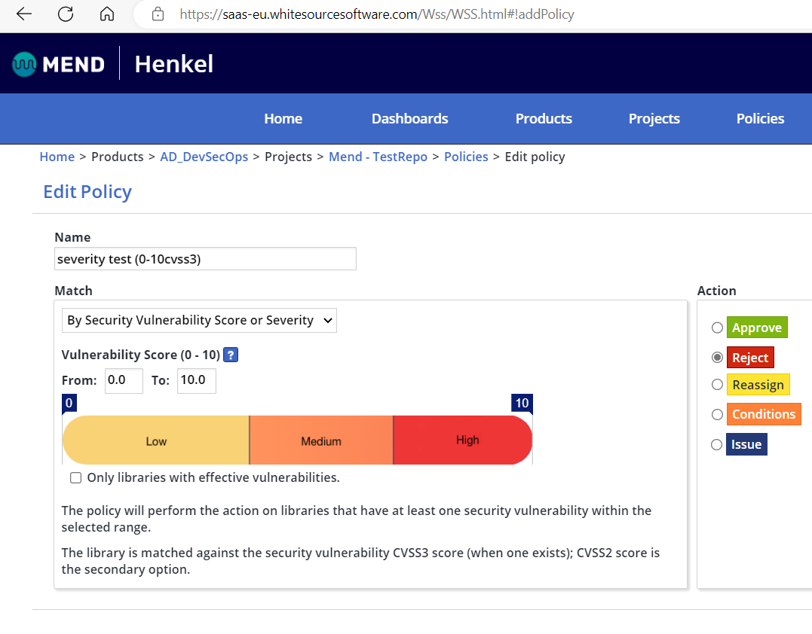
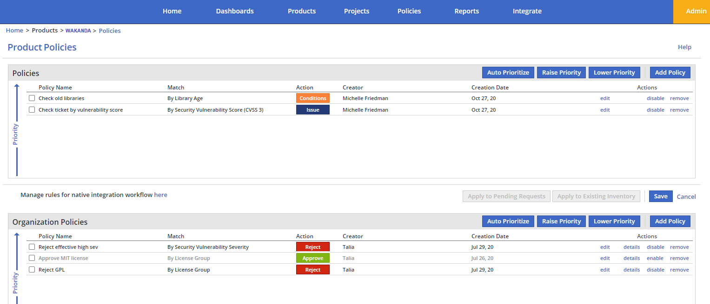

### Pipeline-Blocking using Policies
For blocking an Azure DevOps pipeline in case of a found vulnerability in a library, a reject-policy needs to be added to the Mend project. 

The policy in this example will be triggered, for every vulnerability identified.
You can customize the policy and configure the trigger to only notify for a certain cvss score range. A good example is to adapt the reject policy to trigger only on high vulnerabilities (cvss3 > 7).

Keep in mind that there are three kinds of policies, which are active on different levels:
- project specific (repository)
- product wide (multiple projects)
- Organizational (global)

Organizational policies are managed via the Policies menu item from the main menu. 

In the Policies page, you can view, add, edit, change the priority of, enable/disable, and remove policies.

Product-level policies are available for products that want to set their own policies which override the organizational ones. Product policies are managed from the product page, under the Policies button.



If there are policy conflicts, they are resolved by priority:
Product level policies are of a higher priority than Organization level policies and project level policies are of a higher priority than Product level policies.
(full documentation available at [Mend policy documentation](https://docs.mend.io/bundle/sca_user_guide/page/managing_automated_policies.html)).

Then, the following code block can be used to block the pipeline in case of a policy violation:
```yaml
- task: WhiteSource@21
            displayName: "WhiteSource Security Scan"
            inputs:
               cwd: '$(System.DefaultWorkingDirectory)'
               projectName: $(Build.Repository.Name)
               configuration: |
                 checkPolicies=true
                 updateInventory=true
                 forceCheckAllDependencies=true
            continueOnError: false
```

For blocking a pipeline a policy needs to have a reject action. Furthermore it should be mentioned that a policy can have other actions:
- Aprove certain conditions (useful for exceptions as the policy order affects the matching)
- Reassign (automatically reassign to a designated user or group in the system)
- Conditions (If there is a policy match on a Conditions action, sub-tasks are automatically created as “conditions” for the different assignees according to the policy definition.)
- Issue (Issue tracker integration)
