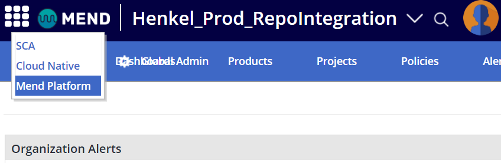

# Mend (formerly WhiteSource) Integration

## Introduction
Mend is an open source depedency scanner and license compliance management platform.
Modern software projects usually rely on open source third-party dependencies. Keeping this
dependencies up-to-date and free of public known vulnerabilities is a complex task.
Mend scans the dependencies of your project on every build for security issues and 
license compliance.

Any project that consumes open-source software dependencies should use Mend and integrate its automated checks in CICD pipelines.
Please note that consumption is based on “contributing developers”, so all contributors that modify repositories or pipelines, as well as those users being active on the Mend application itself, are counted. In case only a few lines of code are being changed or a pipeline is being started manually, try to save licenses and request regular contributors to perform the action.

[Login To Henkel Mend Instance](https://saas-eu.whitesourcesoftware.com/Wss/WSS.html#!home)

## MUST Requirements for Mend Integration

To have proper reporting and overview about vulnerabilities in Mend **it is required to have separate Mend integrations for production and non-production branches. Therefore two Mend integrations are required:** 
- **One for non-production branches via integration in the pipeline.**
- **One for production branches via direct integration with Azure DevOps within each repository.**

### Benefits:
- Better Overview between Prod and Dev Branches
- Automatic task creation for vulnerabilities in Azure DevOps (created per Library) 
- Automatic pull request created for vulnerablites in Azure DevOps (created per Library)
- Ability to launch Mend scan in pull request and seeing Mend results in Pull request
- Mend scanns all branches in the background during a commit and shows results in the commit section
- No duplicate entries in Mend created e.g. "someEntry_1", "someEntry_2"

## 1) Integration for Production Branches - via Mend Repository Integration

[How to Mend Repository Integration](mend-repository-integration/general.md)

## 2) Integration for Non-Production Branches - via Mend Unified Agent in Pipeline Integration

[How to Mend Pipeline Integration](whitesource-sub/general.md)

## Dealing with Findings
[Please check here how to deal with findings and establish a vulnerability remediation process.](remediation.md)

## Launch New Mend UI
To open the new Mend UI navigate to the top left corner and click on "Mend Platform". Here you can find an [introduction video to the new Mend UI](https://henkelgroup.sharepoint.com/sites/SharedResponsibility/SitePages/Wissenswertes-f%C3%BCr-Entwickler.aspx).

