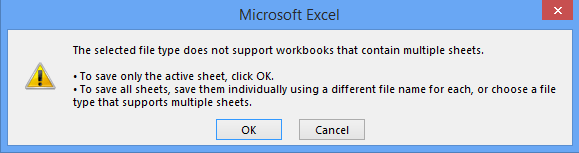

# kyndryl Monthly Imports

## Explanation

Each month, <del>IBM</del> kyndryl provides the **baseline**, a key tool for our service management team. DC Architecture [checks the version for approval](https://henkelgroup.sharepoint.com/:f:/r/teams/QualityLibraryDC/Docs/Architecture/Configuration%20Management/Baseline-%20For%20Approval?csf=1&web=1&e=pOsZWW) for formatting issues and obvious mistakes. If none are found, the baseline will be approved by DC Arch and kyndryl will [publish it in the folder for the corresponding year](https://henkelgroup.sharepoint.com/:f:/r/teams/QualityLibraryDC/Docs/Reports/Master%20List%20-%20Service%20Baseline?csf=1&web=1&e=EKZi6g).

DC Arch imports the baseline to a database where it will be used in various reports in [IBM Stats grafana](https://ibmstats.henkelgroup.net/).

Also each month, kyndryl provides the **invoice**.

## Prerequisite

For imports, the following components are required:

* Excel
* Python 3, in WSL will do
* The [Baseline Importer](https://dlgit.henkelgroup.net/datacenter/baseline-importer), despite its name it contains the invoice importer too
* Microsoft SQL Server Management Studio, or any other tool to run SQL on an MS SQL server
* Import credentials, see the sample file [importercredentials_sample.py](https://dlgit.henkelgroup.net/datacenter/baseline-importer/-/blob/main/importercredentials_sample.py), save it as `importercredentials.py` and add the real password

## Importing the Baseline

### Prepare the Excel File for Import

!!! note ""
    Apologies for this additional step. However the pressure was never high enough to read and import directly from the Excel sheets via Python.


* open Baseline file in Excel
* for each sheet _Systems_, _MSO_ and _Scanned Subsystems_ perform the following steps:
  * select the corresponding sheet
  * ensure that no filter is active (ALT+V L)
  * press _F12_ (Save As)
  * select filetype _Text (Tab separated) *.txt_
  * Depending on the sheet, use one of the following prefixes: _Baseline_, _Subsys_, or _MSO_. See box [Filenames might vary for you](#import-to-database) below.
  * click _Save_
  * click _OK_ to acknowledge the message box "The selected file type does not support workbooks that contain multiple sheets."<br />

* When closing the file **do NOT save** the changes. Don't worry. The text files have been created.

### Import to database

!!! warning "Filenames might vary for you"

    I saved the baseline files always with the following filename scheme `${prefix} IBM ${baselineyear}m${baselinemonth}_${release_year}${release_month}${release_day}.${extension}`.

    File extension depends on the format: `.xlsx` or `.txt`

    E.g. April 2023 baseline has been provided by kyndryl on 2023-04-21, so I saved the file as `Baseline IBM 2023m04_20230421.xlsx`. This results in the follwing filenames:

    | Sheet | Prefix | Example |
    | --- | --- | --- |
    | Systems | Baseline | `Baseline IBM 2023m04_20230421.txt` |
    | MSO | MSO | `MSO IBM 2023m04_20230421.txt` |
    | Scanned Subsystems | Subsys | `Subsys IBM 2023m04_20230421.txt` |

    For a more detailed explanation, see [https://dlgit.henkelgroup.net/datacenter/baseline-importer/-/blob/main/README.md](https://dlgit.henkelgroup.net/datacenter/baseline-importer/-/blob/main/README.md)


Imports will take some minutes because 15.000-20.000 rows will be inserted.

#### Import Baseline

```
importBaseline.py -f Baseline\ IBM\ 2023m04_20230421.txt
```

#### Import MSO

```
importMSO.py -f MSO\ IBM\ 2023m04_20230421.txt
```

#### Import Subsys

```
importSubsys.py -f Subsys\ IBM\ 2023m04_20230421.txt
```


### Quality Checks

#### Issues During Import


!!! info "Hint"

    Following the philosophy of Linux and Unix tools, the import scripts will only complain if there's something wrong. No output means all good.

The import scripts will report if the line format does not match. However the will not check for invalid values within the rows.

A typical message would be:

```
Unusual number of tokens (13) per line in file MSO\ IBM\ 2023m04_20230421.txt
```

This means that the imported sheet contains data in more columns than agreed. Address this to kyndryl.

#### Issues After Import

See the attached SQL files `*_qa.sql` with queries that inspect the corresponding tables:

* [queries_baseline_qa.sql](../files/queries_baseline_qa.sql)
* [queries_mso_qa.sql](../files/queries_mso_qa.sql)
* [queries_subsys_qa.sql](../files/queries_subsys_qa.sql)

Some of the queries will provide an overview of the values in the tables. Some of the queries are marked in the SQL file and should not provide any result. Any potential result here would be an issue that needs to be addressed to kyndryl.

Some of the issues can be fixed running the statements in the attached SQL files `*_qa_fixes.sql`.

* [queries_baseline_qa_fixes.sql](../files/queries_baseline_qa_fixes.sql)
* [queries_mso_qa_fixes.sql](../files/queries_mso_qa_fixes.sql)
* [queries_subsys_qa_fixes.sql](../files/queries_subsys_qa_fixes.sql)

Finally the following dashboards and reports will be checked:

* [https://ibmstats.henkelgroup.net/d/ye_XCDJnk/baseline?orgId=1](https://ibmstats.henkelgroup.net/d/ye_XCDJnk/baseline?orgId=1)
* [https://ibmstats.henkelgroup.net/d/BmkNR8eMz/oracle-license-demand?orgId=1](https://ibmstats.henkelgroup.net/d/BmkNR8eMz/oracle-license-demand?orgId=1)

If BASIDs will be reported as unknown, please follow [Update BASID list](kyndryl-update-basid-list.md).

If the import went without issues, the baseline can be approved from formatting perspective. However it could still contain issues content-wise, e.g. servers in wrong state. That's not a topic for DC Arch but mainly Service Management.

## Importing the Invoice

Save the provided MI file somewhere. Note that the provided filename is usually in the format <code>HENKEL MI FILE <span style=color:red>MMYYYY</span>.CSV</code>. However <code>YYYYMM</code> is more reasonable, sorts itself, and I like it more. Therefore the importer expects the file in the format <code>HENKEL MI FILE <span style=color:red>YYYYMM</span>.CSV</code>. I also prefer to prefix the received date in ISO format to the filename, e.g. `20230421 HENKEL MI FILE 202304.CSV`, but that's optional.

In contrast to the baseline, the invoice is already in text format. After saving, you can immediately start importing it:

```
importInvoice.py -f 20230421\ HENKEL\ MI\ FILE\ 202304.csv
```

After importing, check the corresponding dashboards and reports in [Report Analysis folder](https://ibmstats.henkelgroup.net/dashboards/f/M64fYUmVk/report-analysis).

If BASIDs will be reported as unknown, please follow [Update BASID list](kyndryl-update-basid-list.md).

After checking, inform the financial team about the import.

## Technical Details

### Database

* Server: dedussvfpsql01, running in DigiLab
* Instance: Shared
* Database: ClientOracleJava
* Tables:
  * serversBaselineIBM: Systems sheet data goes here
  * serversMSOIBM: MSO sheet data goes here
  * serversSubsysIBM: Scanned Subsystems sheet data goes here
* Credentials:
  * User: baselineimporter
  * Password: TBD