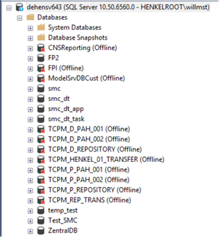

# Naming convention for Data Center objects

## Problem Statement

Without a naming concept, naming of IT-objects within any data center can easily end up in disarray, which will subsequently lead into a incomprehensible collection of arbitrary names and higher friction for IT operation and other functions.

## Assumptions

Stakeholders embrace structural and comprehensible naming of IT-objects.

## Motivation

Readability, ability to derive function from name and vice versa, possibility to order-by-name in lists and tables are key points to deterministic naming, which subsequently supports a frictionless dealing with names of IT-objects on IT operations, architecture and even down to application management and service desk.

Naming provided by any 3rd party will not need to be aligned with Henkel, reducing administrative overhead.

## Implications

Whenever a new IT-object is created or renamed, the person and/or toolset doing this needs to adhere to this definition.

Straying from it might lead to re-creating or renaming of the formerly falsely named object.

**Attention:** Existing footprint is not to be changed just to adhere to the new naming standards.

## Implementation

### Hostnames

The following format for hostnames to be used: [GG](#gg-geographical-code)[LLL](#lll-location-code)[TT](#tt-type-of-device)[P](#p-purpose)[NNNNN](#nnnnn-numbering)

Generally, the naming convention for hostnames follows [Client & Directory Services Public - AD-Policy (sharepoint.com)](https://henkelgroup.sharepoint.com/teams/DirectoryServices/Public/Documentation/AD-Policy.aspx#Hostnames).

All hostnames must be exactly 13 characters long. Although Active Directory allows 15 characters, SAP systems are limited to 13 characters only, hence this decision is taken.

#### GG - Geographical Code

| Token | Location of Server |
| --- | --- |
| DE | Germany | 
| US | United States | 
| &lt;other countries&gt; | 2-character code according to ISO 3166-1 | 

#### LLL - Location Code

Based on United Nations’ Code for Trade and Transport Locations (UN/LOCODE). The codes can be found on [https://www.unece.org/cefact/locode/service/location](https://www.unece.org/cefact/locode/service/location).

Click on the corresponding country code (e.g. DE or US) and find a list of all cities with the corresponding code.

**Examples:**
* Düsseldorf = DUS
* IBM Data Center = IBM (as not exactly being in one location)

#### TT - Type of Device

| Token | Type |
| --- | --- |
| SV | Server | 
| WS | Workstation or Client Computer | 
| CL | Cluster IP | 
| LB | Load Balancer VIP  (see below for specifics) | 
| VI | Virtual Instance (e.g. for active/active MS SQL instances) | 

List can be extended upon request.

!!! info

    OS clusters often consist of servers (SV) and a cluster IP (CL).

#### P - Purpose

Purpose is usually used after SV/LB types

| Token | Purpose | Example / Clarification |
| --- | --- | --- |
| S | SAP System component | SAP SCS, AS (ABAP + Java), DB, etc. | 
| U | Utility Services  | e.g. Terminal Services / Citrix, ADFS Service, SMTP, Reverse Proxies, etc. | 
| I | Infrastructure  | e.g. VMware ESX hosts, Storage System, etc. | 
| M | Middleware System | e.g. webservers, DB Server, etc. | 
| D | Domino |  | 
| B | Business Intelligence aka. “BI” |  | 
| R | Robotics or other human-simulating agents |  | 
| N | Non-SAP resp. _does not fit into other class_ | application servers | 
| C | CyberSecurity (dxS) related | e.g. SIEM, Nessus, Threat Intelligence, etc. | 

List can be extended upon request.

#### NNNNN - Numbering

There's different numbering schemes depending on the usecase.

See the numbering scheme below for each usecase:

* [General numbering (does not match any other purpose)](#general-numbering-does-not-match-any-other-purpose)
* [SAP specific numbering](#sap-specific-numbering-gglllttsnnnnn)
* [Load balancer numbering](#load-balancer-numbering-ggllllbpnnnnn)

##### General numbering (does not match any other purpose)

Sequential Number, 5-digits, filled with leading zeroes.

It is advisable to form blocks of thousands (or hundreds) to group certain purposes on a by-hostname basis, wherever applicable.

The first digit <u>**N**</u>NNNN conveys a classification concerning **landscape positioning**.

| N1 | Description | 
| --- | --- |
| 1 | Production | 
| 3 | Test / Quality Assurance | 
| 5 | Development | 
| 7 | Sandbox / Proof of Concept / temporary purpose | 
| 9 | Golden Master / Template System | 

N2-N5 have no special meaning. Choose freely or number consecutively.

##### SAP specific numbering / GGLLLTTSNNNNN

N-digits 1-3 <u>**NNN**</u>NN carry the SAP System ID (SID) and therefore implicitly define the *landscape positioning* (via N1).

| N1 | N2 | N3 | Description | 
| --- | --- | --- | --- |
| P | ? | ? | Production | 
| Q/R/C/K | ? | ? | Quality Assurance / Test / Consolidation | 
| D | ? | ? | Development System | 

**Remark:**
There are cases out there which stray from this. Not always is the first character of the SAP System ID (SID) according to column N1 in the table above. In some cases, the system does not even have a SID at all. In such a case, use column N1 anyway to convey the meaning.

The reader with “SAP Basis” background knowledge in Henkel’s context will understand it anyway, for everybody else it will not be overly important.

**Special case:** Multiple SIDs populating one Operating System instance (“shared SAP host”)

| N1 | N2 | N3 | Description | 
| --- | --- | --- | --- |
| ? | X | X | First digit like above. Second + Third digit = XX to designate a shared SAP host. **Mixing SIDs of different landscape positioning should be avoided.** | 

The type of the SAP component will be distinguishable via N-digit 4.

| N1 | N2 | N3 | Description | 
| --- | --- | --- | --- |
| ??? | S | ? | (A)SCS, Message Server, Enqueue Server, ERS, etc. N5 range: 1..2, as SCS is usually active/passive or standalone **Select this, even if an PAS/AS is installed along with your SCS.** | 
| ??? | D | ? | Database N5 range: 1..2 for database nodes (active/passive or standalone) | 
| ??? | A | ? | Application server N5 range: 1..9,A..Z (zero skipped on purpose) | 
| ??? | X | ? | Special use-cases like SAPRouter, etc. | 
| ??? | M | ? | Monolith / mixed components of the same SID Monoliths should only be used for small systems and are always subject to approval by Henkel SAP Basis | 

##### Load Balancer Numbering / GGLLLLBPNNNNN

The first digit <u>**N**</u>NNNN conveys a classification concerning the **network zone**.

| N1 | Description |
| --- | --- |
| 1 | Intranet | 
| 8 | Inner-DMZ | 
| 9 | Outer-DMZ | 

The second digit N<u>**N**</u>NNN conveys the **landscape positioning**.

| N2 | Description |
| --- | --- |
| 1 | Production | 
| 3 | Test / Quality Assurance | 
| 5 | Development | 
| 7 | Sandbox / Proof of Concept / temporary purpose | 

N3-N5 have no special meaning. Choose freely or number consecutively.

!!! warning "Attention: This section only applies for data center provider operated devices outside their "central" locations."

    **Specifics for DC provider operated devices in Remote Locations**

    In order to identify the remote location quickly and accurately, there is an extension for this when defining the hostnames. For remote sites in Henkel environment the host naming convention is almost identical to the general definition, but extended by a location-specific part:

    GGLLLTTP<u>**RRR**</u>NN

    **RRR** will be the United Nations’ Code for Trade and Transport Locations (UN/LOCODE), which define 3-letter codes for almost all cities in every country.

    The code can be found on URL [https://www.unece.org/cefact/locode/service/location](https://www.unece.org/cefact/locode/service/location). Click on the right country code (e.g. DE or US) and find a list of all cities with the corresponding code.

    The remaining **NN** should be used like described above.

## Network Interface Controller (NIC)

### Frontend controller / “Service adapter”

For each server there will be one NIC posing the “Service Adapter”. The naming convention follows the hostname naming convention (&lt;HOSTNAME&gt;).

**Example**

* DEDUSSVM1xxxx

### Admin controller / “ADMIN ADAPTER”

The optional **Admin Controller** should follow a naming convention that includes &lt;HOSTNAME&gt; of the Frontend controller and adds a suffix, e.g. like "-adm", "-mgmt" or similar.
Please decide on a pattern for your scope and follow through with it.

### Backend controller / “BACKEND ADAPTER” / “SERVER-TO-SERVER ADAPTER”

For each server there will be **zero or more** NICs per server. The naming convention can be picked from several options:

Option 1: &lt;HOSTNAME&gt;-b&lt;VLANID&gt;.
&lt;VLANID&gt; stands for the ID of the VLAN where the backend controller is connected to.
The “Backend Adapter” should be used to by-pass a Layer-3-Router only for network performance reasons, as such a router will add a tiny amount of latency, which will impact large data transfers negatively to a certain – usually small – extent.
Since all Intranet VLANs will be connected via the same VMWare NSX T1 Cluster, it is not expected, that there will be many “Backend Adapters” required.

Option 2: &lt;HOSTNAME&gt;-ic ("ic" for interconnect).

Option 3: Your own pattern

## Database Instance Name for MS SQL / Oracle / etc.

The database instance names should always relate to the application/system for better clarity.
If a kind of **main identifier** exists (e.g. a "BASID" / Business Application System ID like in IBM's scope), it should be used wherever technically possible.

**Attention:**

* Remove the underscore “_” from the **main identifier** string if applicable.
* Please cut the **main identifier** wisely and appropriately dealing with length-limitations
  * Oracle Instance Names are limited to 8 characters.
  * MSSQL Instance Names are limited to 16 characters.
* If a **main identifier** needs another instance of the same kind, replace the last character by 2, 3, 4, etc.
* MSSQL Active Directory based naming:
  * When used to register MSSQL instance names within Active Directory, naming conforms to the MSSQL Instance Naming convention above.

For the sake of portability, it is **mandatory** to **assign DNS aliases** (CNAME) to the database server or cluster running the instance. This will allow a change of the underlying server resp. cluster without the need to re-configure the application/system connecting to them, simply by changing the DNS alias target.

The applications/systems **must** use the aliases, **never the “physical” name** of the database server or cluster!
The aliases should be generated like this, &lt;name&gt; being the instance name:

| Type | Alias (always lower-case) |
| --- | --- |
| Oracle | &lt;name&gt;-db-ora.henkelgroup.net | 
| MSSQL | &lt;name&gt;-db-mssql.henkelgroup.net | 
| MariaDB | &lt;name&gt;-db-maria.henkelgroup.net | 
| PostgreSQL | &lt;name&gt;-db-pgsql.henkelgroup.net | 
| MongoDB | &lt;name&gt;-db-mongo.henkelgroup.net | 

**Example**

* MSSQL: N0WALLSTREET, N0WALLSTREE2
  * DNS Alias: n0wallstreet-db-mssql.henkelgroup.net
  * DNS Alias: n0wallstree2-db-mssql.henkelgroup.net
* Oracle: N0WALLST
  * DNS Alias: n0wallst-db-ora.henkelgroup.net

## Database Names

If technically possible, the database names (inside a database instance, e.g. in MSSQL) **should** follow the database instance naming convention.
In some cases, applications have “hard-coded” database names and these will be okay, as long as the database instance has a proper naming.

**Examples:**

* MSSQL:
  * Instance Name: N0SMS
  * Database Name(s): smc, smc_dt, smc_dt_app, smc_dt_task

Real-life example (SMS application):

## System- / Interface-Accounts

Whenever a system or interface account needs to be created for a fully managed service provided by IBM, such as running a MSSQL Database Instance, a managed container process, etc., the following naming should be used for the accounts: &lt;abbreviation&gt;_sv_&lt;purpose&gt;.
Whereas &lt;abbreviation&gt; can be the friendly abbreviation of your scope (e.g. "IBM", "DLO" (DigiLab), etc.) and &lt;purpose&gt; should describe what the account’s purpose is or at least strongly indicate the area (Application Name, System Name, BASID, etc.).

**Exception:**
In some cases, account names are technically implied, such as _oracle_ and &lt;SID&gt;_adm_ for SAP systems, and many well-known accounts on Linux systems, such as _wwwrun_, _sshd_, _daemon_, _systemd_, _root_, etc.