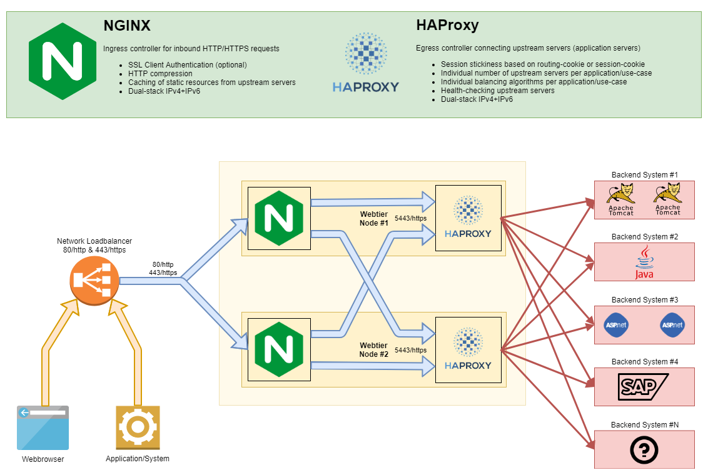
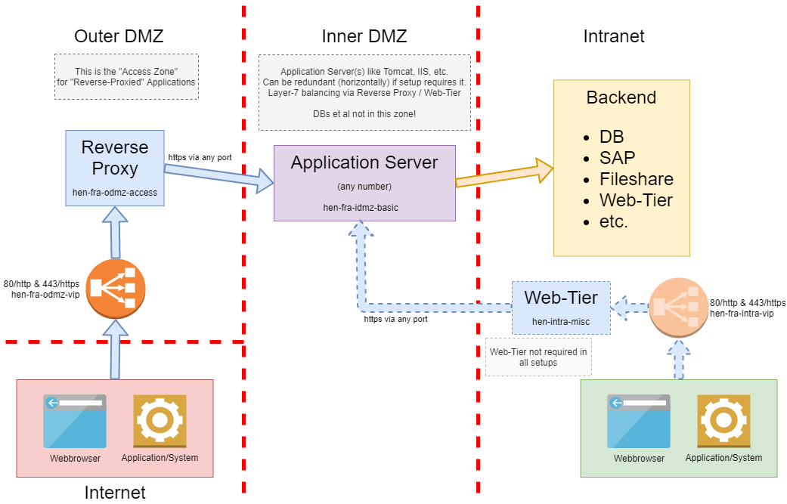
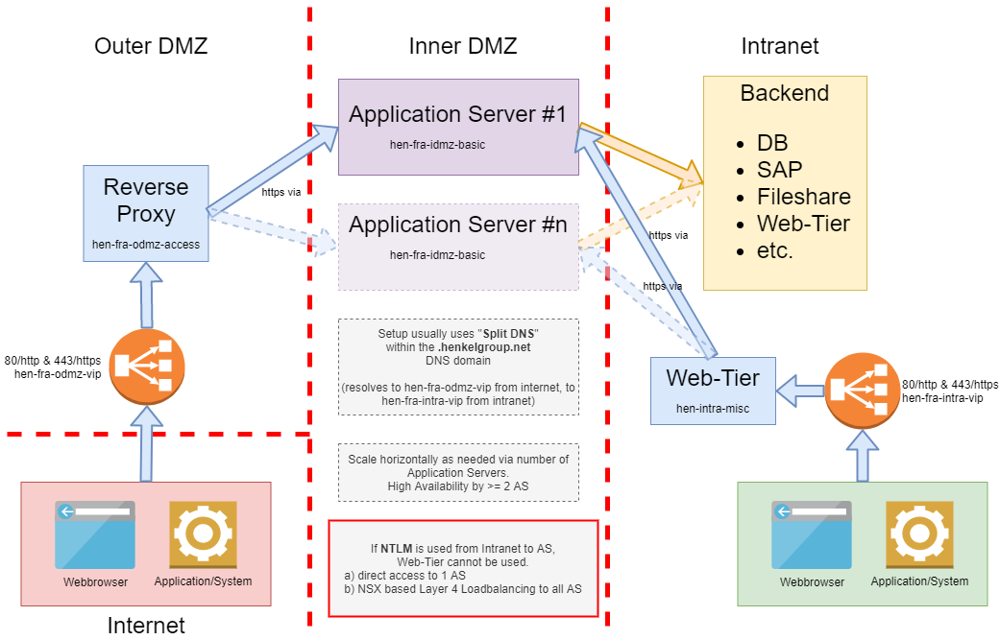

# Web-Tier

## tl;dr

* Change Requests via [SNOW Request Forms for Web-Tier](https://henkelprod.service-now.com/sp?id=sc_category&sys_id=1757fe831b7f681097eaea836b4bcb11)
* DNS changes are **NOT** done by the Web-Tier Operations Team
  * DNS change-request templates are available within SNOW
* You must use HTTPS (HTTP is not okay)
* Does not work with NTLM
* Check the [Common Issues](#common-issues) section on the bottom of this article

## Problem Statement

Most applications are web-based and require a web-server to enable the users to use them. Web-protocols are nowadays also commonly used for machine-to-machine communication.

Features as SSL/TLS encryption, SSL client certificate authentication, HTTP compression, caching, etc. are mandatory to be used to provide proper fidelity to the end-users and other web-clients.

A 1:1 mapping of &lt;web-based application&gt; to &lt;webserver installation&gt; would lead to hundreds of &lt;webserver installations&gt; without any consolidation, standardization or harmonization effects,
as well as increasing the amount of operational effort for patching, updates, housekeeping, etc.

Additionally, there is a need for a "gatekeeper" to secure access from the Internet, when it comes to publishing applications on the same.

## Assumptions

In most cases, the web-servers are solely used to reverse-proxy the inbound requests to the application server instance running on the same host.

A consolidated, standardized Web-Tier platform to channel most of the inbound HTTP/HTTPS traffic and reverse-proxy it to the certain application servers will lead to higher security (SSL standards), higher performance (compression, caching), better transparency and logging.

Most application teams struggle with webserver technology. Taken it off their hands will allow them to focus on the applications.

## Motivation

Reduction in the number of &lt;webserver installation&gt; will reduce operational overhead and will use system resources in a more efficient way. Renewal of expiring SSL certificates can be done in time, as a central overview is available, which will lead to less outages.

## Implications

New web-based applications need to be embedded in the Web-Tier setup.
Currently, web-based applications facilitating NTLM-authentication cannot be provided via the Web-Tier, as NTLM breaks the HTTP standard and does not work properly via any kind of reverse proxy.

If new applications are planned, ordered, deployed, etc., the requirement of being published via the Web-Tier must be communicated.

Clients using the Web-Tier via HTTPS (which should be any client at any time) must use "Server Name Indication" (SNI), which usage is a default since many years. (see [Wikipedia: Server Name Indication](https://en.wikipedia.org/wiki/Server_Name_Indication))
Otherwise, they will be presented with the Web-Tier's default SSL server-certificate, which (from their point of view) looks "invalid".

## Features

The following features come out-of-the-box and are enabled by default - if not stated otherwise:

* High-availability via twin-setup and network loadbalancer
* HTTP compression ([https://datatracker.ietf.org/doc/html/rfc7694](https://datatracker.ietf.org/doc/html/rfc7694))
* HTTPS-Encryption using TLS v1.2 + v1.3
* Content-Caching on the Web-Tier itself ([https://www.w3.org/Protocols/rfc2616/rfc2616-sec13.html](https://www.w3.org/Protocols/rfc2616/rfc2616-sec13.html))
  * Applications MUST ensure to send the proper HTTP Cache Headers to control what is to be cached and for how long. Everything else is a violation of RFC2616, section 13.
* Session-stickiness - HTTP requests of the same user/brower-combination will always end up on the same backend application server
* Detection of unavailable backend applications
* Optional: SSL Client Certificate Authentication (available modes: optional or mandatory)

## Operation

Operation of the Web-Tier components (see below) is done by a 3rd party.
Change requests via [SNOW Request Forms for Web-Tier](https://henkelprod.service-now.com/sp?id=sc_category&sys_id=1757fe831b7f681097eaea836b4bcb11) (Outer DMZ CRs will have an approval step by the Security Team)
If the change request is just about a tiny bit of the configuration, please use a generic text request instead, not the full blown form. Send it to the group mentioned below.
Incidents (and tiny configuration changes) will be handled by SNOW `Group GLOBAL.C.DXV.INFRA.Operations.WebTier.X` - please remember, **a change request is not an incident**.

!!! note
    **Hint: DNS changes** are done by a **different team** and have to be created in a **separate request ticket**.

## Technical details

The solution consists of three components:

* Network Loadbalancer - to render the setup high-available
* NGINX - one of the most utilized web-server software on the planet
* HAProxy - a reverse proxy software especially designed to dispatch requests to multiple backends (= application servers) in an efficient way

Though both components, NGINX and HAProxy, would be able to fulfill the functional requirements on their own, only in combining both the result will have the best of both worlds. NGINX excels in serving web-content, but lacks the desired "session-stickiness" capabilities in the license-free product.

HAProxy is complex in configuration concerning functionality which is very simple to be implemented on NGINX (or Apache HTTPD), but is superior in managing the application backends.

### Component layout

### Combining NGINX and HAProxy

NGINX's configuration focuses on FQDNs (Fully Qualified Domain Name), which represent the left portion of any Web-URL (the host-portion).
Certain FQDN configurations (also known as "vhosts" / "virtual hosts") have multiple backends, e.g. if an application is comprised of multiple Microservices,
each running on different host/port combinations.

NGINX must be able to inform HAProxy per URL-request, which backend is to be picked. It does so by sending a specific HTTP header called `BACKENDSELECTOR` with a value out of a certain mapping-file in the HAProxy configuration. The value of the header will tell HAProxy which of the application-backends is to be used for the request at hand.
After HAProxy selected the correct backend, the header is removed again from the request, so that the application-backends (nor the web-browser) never get to see it.

### Existing Web-Tiers

| Location | Purpose | Network Zone | Loadbalancer FQDN (target of DNS CNAMEs) | Individual Hosts | Firewall Object Names | Comments |
| --- | --- | --- | --- | --- | --- | --- | 
| IBM Softlayer | Production | Intranet | [deibmlbm10007.henkelgroup.net](http://deibmlbm10007.henkelgroup.net) | [deibmsvu10001.henkelgroup.net](http://deibmsvu10001.henkelgroup.net) [deibmsvu10002.henkelgroup.net](http://deibmsvu10002.henkelgroup.net) | SG_PROD_INTRA_WEBTIER_PROD | Access from same subnet via 193.187.14.599 |
|IBM Softlayer | non-production | Intranet | [deibmlbm10008.henkelgroup.net](http://deibmlbm10008.henkelgroup.net) | [deibmsvu30001.henkelgroup.net](http://deibmsvu30001.henkelgroup.net) [deibmsvu30002.henkelgroup.net](http://deibmsvu30002.henkelgroup.net) | SG_PROD_INTRA_WEBTIER_NONPROD | Access from same subnet via 193.187.14.140 |
| DigiLab | PoC/test/dev | Intranet | [deduslbdlweb01.henkelgroup.net](http://deduslbdlweb01.henkelgroup.net) | [dedussvfpweb03.henkelgroup.net](http://dedussvfpweb03.henkelgroup.net) [dedussvfpweb04.henkelgroup.net](http://dedussvfpweb04.henkelgroup.net) | 
| IBM Softlayer | Production | Internet / Outer DMZ | [rpfralbn.henkelgroup.net](http://rpfralbn.henkelgroup.net) (normal) [rpfralbz.henkelgroup.net](http://rpfralbz.henkelgroup.net) (mandatory SSL client cert. auth) | deibmsvm10012.henkelgroup.net deibmsvm10013.henkelgroup.net | SG_PROD_ODMZ_ACCE_DMZRPX |  |
| DigiLab | PoC/test/dev | Internet / Outer DMZ | [rpduslbn.henkelgroup.net](http://rpduslbn.henkelgroup.net) (normal) [rpduslbz.henkelgroup.net](http://rpduslbz.henkelgroup.net) (mandatory SSL client cert. auth) | dedussvm10000.henkelgroup.net dedussvm10001.henkelgroup.net | | |

### Difference Intranet vs. Outer DMZ

The intranet-based Web-Tiers can be used to serve web-applications which also reside on the intranet.
The Outer-DMZ-based Web-Tiers can be used to serve web-applications to the Internet. Security policy implies that the application servers (backends) will be placed in the Inner-DMZ,
which resides between Outer-DMZ and Intranet, for good security measure. In consequence, there can be two different DMZ-deployment patterns.

The **"default"** for the Outer DMZ:

The **"sandwich"**, serving the same application to both worlds, intranet and internet, usually using a so-called "Split-DNS" DNS entry (intranet DNS pointing to intranet web-tier, internet DNS pointing to internet/Outer-DMZ web-tier),
with the **identical** URL for the end-users.

### Common Issues

As any system only works as well as it was designed to be - and that highly depends on the nitty gritty details in the configuration, please find a list of common issues below and their likely fixes,
that you can request via SNOW like stated above.

| Issue | Explanation | Fix |
| --- | --- | --- |
| HTTP 413 - request entity too large | If your web-application relies on file-uploading and/or overly large amounts of data (in our case: larger than the default of 1 megabyte), the web-server will protect itself against this, as large file-uploads / request bodies can be abused for so-called "resource consumption attacks". | Set parameter [client_max_body_size](http://nginx.org/en/docs/http/ngx_http_core_module.html#client_max_body_size) set to the maximum expected size of file-uploads resp. HTTP request body. |
| User A sees personalized content of User B | The Web-Tier caches all content, that is not explicitly flagged (via HTTP headers like _Cache-Control & Expires_). While this is focused on only static content, the Web-Tier cannot possibly know whether the application's content is static or dynamic. If dynamically generated content, which is user-specific, is not flagged to not-cache it, it will be cached and therefore served to other users as well. | The actual issue is on the application, as it **must** honor the existence of so-called downstream web-caches and instruct those via proper usage of the associated HTTP headers how and what to (not) cache. You are asked to file a bug-report with your application developer / vendor on the same.  However, though, it is not always feasible to get the application quickly changed, so here is the **workaround** - and it is nothing more than that: Set parameter & value [proxy_cache off](http://nginx.org/en/docs/http/ngx_http_proxy_module.html#proxy_cache), which will completely disable caching for your configuration - try to be as precise as possible, which /path/to/wrongly/cached/content should be exempt from caching.  There will be a performance penalty and your application's infrastructure will receive more requests, resulting in higher system load, which itself might lead to higher cost, and so on, and so forth. | 
| My external colleague cannot reach the web-page | If an external person needs to use an **intranet**-URL and is not using one of Henkel's own devices, it has to happen via VPN-access. VPN-access allows very precisely to which destination IP-addresses on which ports access is allowed. Everything else is blocked. | This is **not a web-tier issue** at all, but a configuration issue in the external person's VPN profile. You can request the correct destination IP-addresses and ports via the table above using a request ticket in SNOW, directed at the team dealing with the VPN profiles. |
| Command line tools fail with optional/mandatory SSL client certificate handshake | nginx only trusts the root-level of Henkel's CA v3 SSL certificate as per the golden handbook of how to do SSL & TLS. HTTPS / SSL Clients must send the **full chain** (entity first, then intermediary, last CA root)<ol type="a"><li>Client Certificate → Henkel Infrastructure Issuing CA v3 → Henkel CA v3 Root OR</li><li>Client Certificate → Henkel User Issuing CA v3 → Henkel CA v3 Root</li></ol>This - and only this - will enable the webserver side to verify the chain of trust. If it cannot verify the chain of trust, the request will be responded to with HTTP status 400 (SSL handshake error). | Edit your local client certificate file used by your command-line tool in such a way, that the correct order of certificates from root to user is given. It is recommend to download the appropriate .p8 file (in PEM format) via Venafi Certificate Management Portal. This is **not a web-tier issue**, but how SSL/TLS handshakes should work. |

